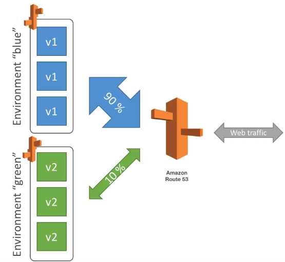
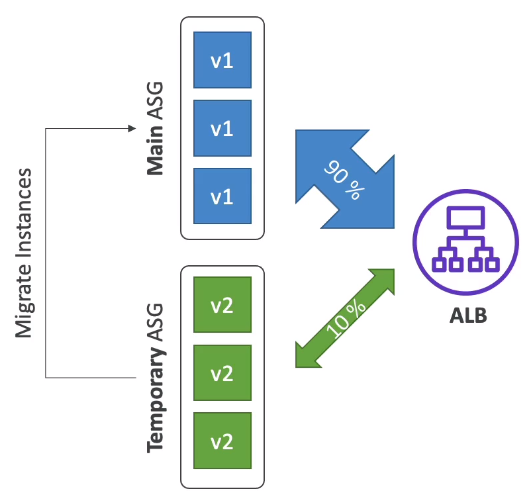

# Elastic Beanstalk Deployment Modes

- Single Instance
    - Great for development
- High Availability with Load Balancer
    - Great for production

## Deployment Options for Updates

- All at once (deploying all in one go) - fastest, but instances aren't available to serve traffic for a bit (downtime)
- Rolling: update a few instances at a time (bucket), and then move onto the next bucket once the first bucket is healthy
- Rolling with additional batches: like rolling, but spins up new instances to move the batch (so that the old application is still available)
- Immutable: spins up new instances in a new ASG, deploys version to these instances, and then swaps all the instances when everything is healthy

## Blue / Green

- Not a direct feature of Elastic Beanstalk
- Zero downtime and realease facility
- Create a new stage environment and deploy v2 there
- The new environment (green) can be validated independently and roll back if there are issues
- Route 53 can be setup using weighted policies to redirect a little bit of traffic to the stage environment
- Using Beanstalk, "swap URLs" when done with the environment test

## Canary testing

- New application version is deployed to a temporary ASG with the same capacity
- A small % of the traffic is sent to the temporary ASG for configurable amount of time
- Deployment health is monitored
- If there's a deployment failure, this triggers and automated rollback.
- No application downtime
- New instances are migrated from the temporary to the original ASG
- Old application version is teminated

## Deployment Summary

- https://docs.aws.amazon.com/elasticbeanstalk/latest/dg/using-features.deploy-existing-version.html