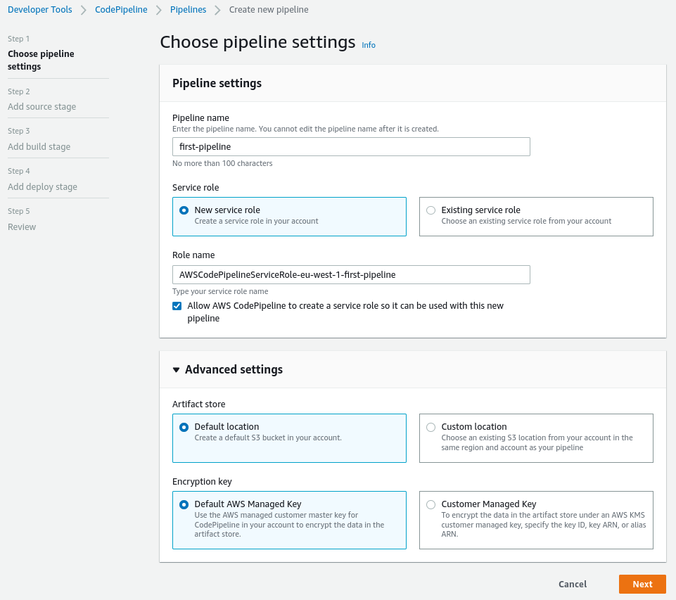
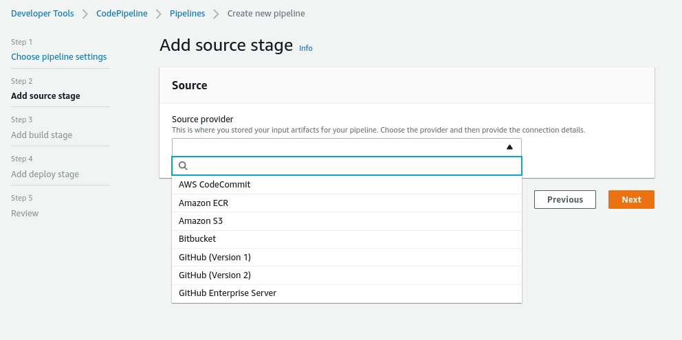
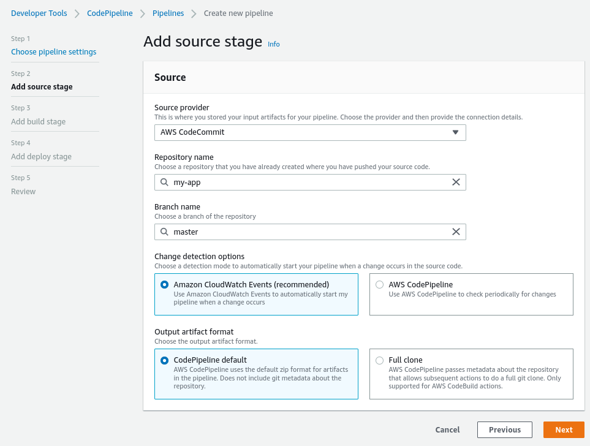
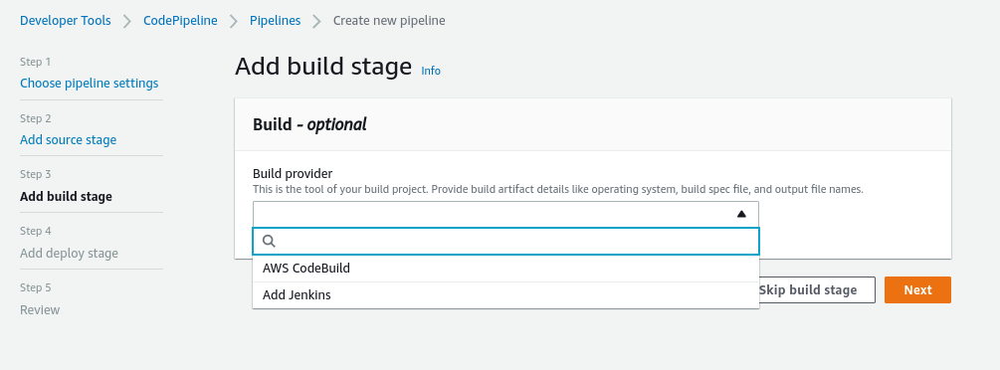
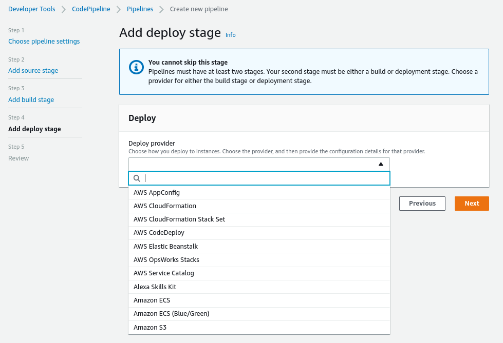
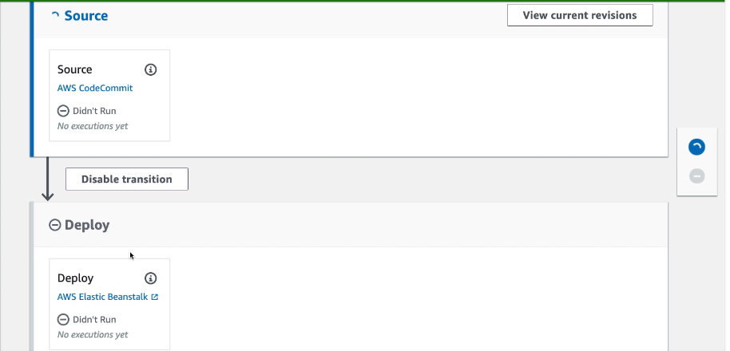
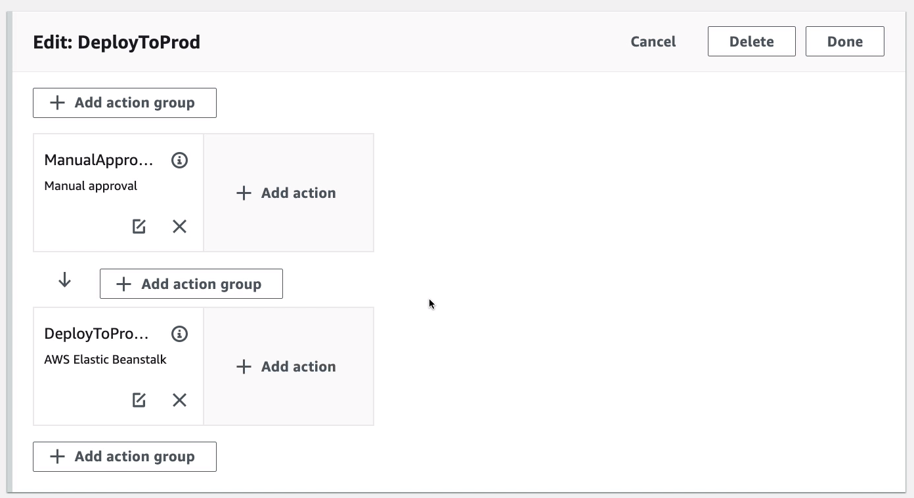

# CodePipeline Hands On

We are going to create a new CodePipeline

Then selecting the change detection options the AWS CodePipeline option isn't really recommended as it will periodically check for changes and it can take time until it's picked up.

When the pipeline is created you can create your own stages and in them you can have multiple action groups.

The actions in an action group will be done in parallel, the next action group will be sequential.