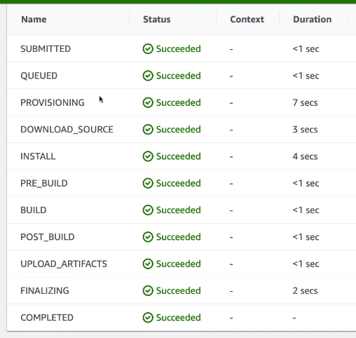
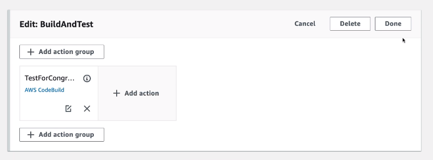

# CodeBuild Hands On Part 2

We can create the buildspec.yml

```yml
version: 0.2
phases:
    install:
        runtime-versions:
            nodejs: 10
        commands:
            - echo "Installing something"
    pre_build:
        commands:
            - echo "We are in the pre build phase"
    build:
        commands:
            - echo "we are in the build block"
            - echo "we will run some tests"
            - echo grep -Fq "Congratulations" index.html
    post_build:
        commands:
            - echo "we are in the post build phase"
```

Once added, the build should succeed.



Then, we can add it to our CodePipeline:

