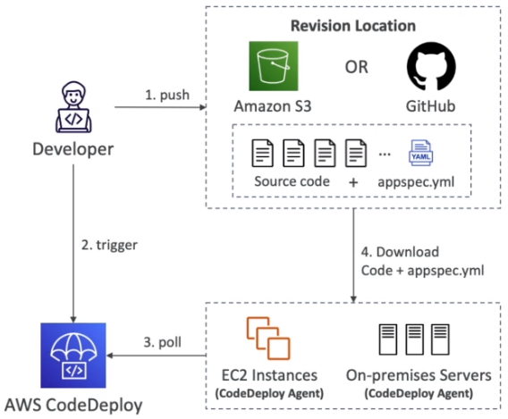
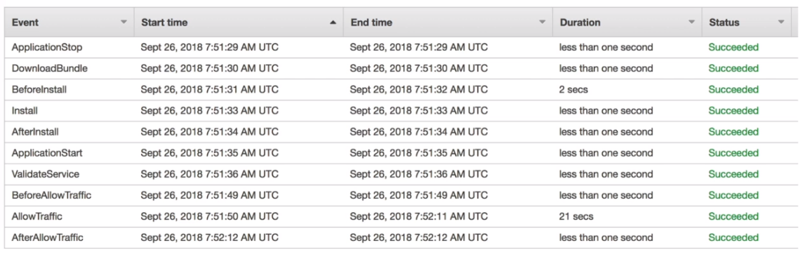

# CodeDeploy Overview

- We want to deploy our application automatically to many EC2 instances
- These EC2 instances are not managed by ElasticBeanstalk
- There are several ways to handle deployments using open-source tools (Ansible, Terraform, Chef, Puppet,...)
- We can use the managed service AWS CodeDeploy

## Steps to make it work

- Each EC2 instance/on-premises server must be running CodeDeploy Agent
- The agent is continously polling AWS CodeDeploy for work to do
- Application + appspec.yml is pulled from GitHub or S3
- EC2 instances will run the deployment instructions in appspec.yml
- CodeDeploy Agent will report of success/failure of the deployment



## Primary Components

- Application - a unique name functions as a container (revision, deployment, configuration)
- Compute Platform - EC2/On-Premises, AWS Lambda, or Amazon ECS
- Deployment Configuration - a set of deployment rules for success/failure
    - EC2/On-premises - specify the minimum number of healthy instances for the deployment
    - AWS Lambda or Amazon ECS - specify how traffic is routed to your updated versions
- Deployment Group - group of tagged EC2 instances (allows to deploy gradually, or dev, test, prod...)
- Deployment Type - method used to deploy the application to a Deployment Group
    - In-place Deployment - supports EC2/On-Premises
    - Blue/Green Deployment - supports EC2 instances only, AWS Lambda and Amazon ECS
- IAM Instance Profile - give EC2 instances the permissions to access both S3 / GitHub
- Application Revision - application code + appspec.yml file
- Service Role - an IAM Role for CodeDeploy to perform operations on EC2 instances, ASGs, ELBs...
- Target Revision - the most recent revision that you want to deploy to a Deployment Group

## appspec.yml

- files - how to source and copy from S3 / GitHub to filesystem
    - source
    - destination
- hooks - set of instructions to do to deploy the new version (hooks can have timeouts), the order is:
    - ApplicationStop
    - DownloadBundle
    - BeforeInstall
    - Install
    - AfterInstall
    - ApplicationStart
    - ValidateService (important)

```yml
version: 0.0
os: linnux

files:
    - source: Config/config.txt
      destination: /webapps/Config
    - source: source
      destination: /webapps/myApp
hooks:
    BeforeInstall:
        - location: Scripts/UnzipResourceBundle.zip
        - location: Scripts/UnzipDataBundle.zip
    AfterInstall:
        - location: Scripts/RunResourceTests.sh
          timeout: 180
    ApplicationStart:
        - location: Scripts/RunFunctionalTests.sh
          timeout: 3600
    ValidateService:
        - location: Scripts/MonitorService.sh
          timeout: 3600
          runas: codedeployuser
```



## Deployment Configurations

- Configurations:
    - On at A Time - one EC2 instance at a time, of one instance fails, then deployment stops
    - Half At A Time - 50%
    - All At Once - quick but no healthy host, downtime. Good for dev
    - Custom - min, healthy host = 75%
- Failures:
    - EC2 instances stay in failed stated
    - New deployments will first be deployed to failed instances
    - To rollback, redeploy old deployment or enable automated rollback for failures
- Deployment Groups:
    - A set of tagged EC2 instances
    - Directly to an ASG
    - Mix of ASG / Tags so you can build deployment segments
    - Customization in scripts with DEPLOYTMENT_GROUP_NAME environment variables