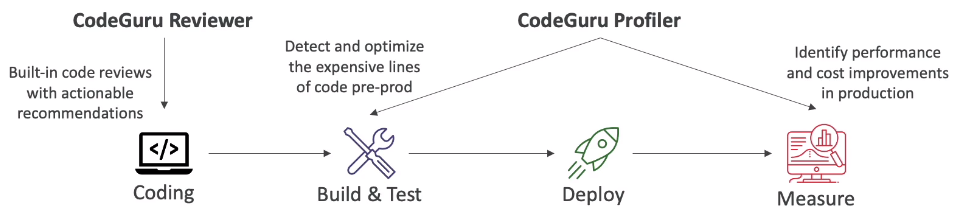

# CodeGuru Overview

- An ML-powered service for automated code reviews and application performance recommendations
- Provides two functionalities
    - CodeGuru Reviewer: automated code reviews for static code analysis (development)
    - CodeGuru Profiler: visibility/recommendations about application performance during runtime (production)

## CodeGuru Reviewer

- Identify critical issues, security vulnerabilities, and hard-to-find bugs
- Example: common coding best practices, resource leaks, security detection, input validation
- Uses machine learning and automated reasoning
- Hard-learned lessons accross millions of code reviews on 1000s of open-source and Amazon repositories
- Supports Java and Python
- Integrates with GitHub, BitBucke and AWS CodeCommit

## CodeGuru Profiler

- Helps understand the runtime behavior of your application
- Example: identify if your application is consuming excessive CPU capacity on a logging routine
- Features:
    - Identify and remove code inefficiencies
    - Improve application performance (e.g. reduce CPU utilization)
    - Decrese compute costs
    - Provides heap summary (identify which objects using up memory)
    - Anomaly Detection
- Support applications running on AWS or on-premise
- Minimal overhead on application