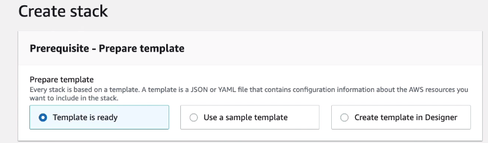
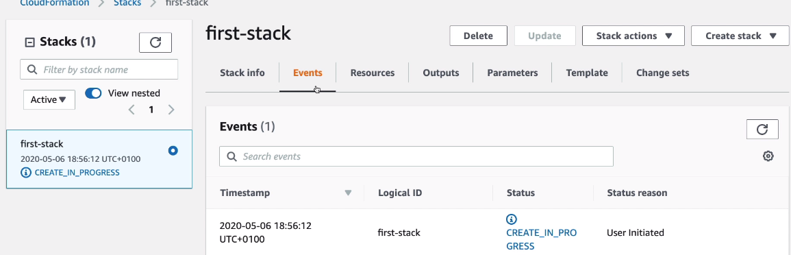
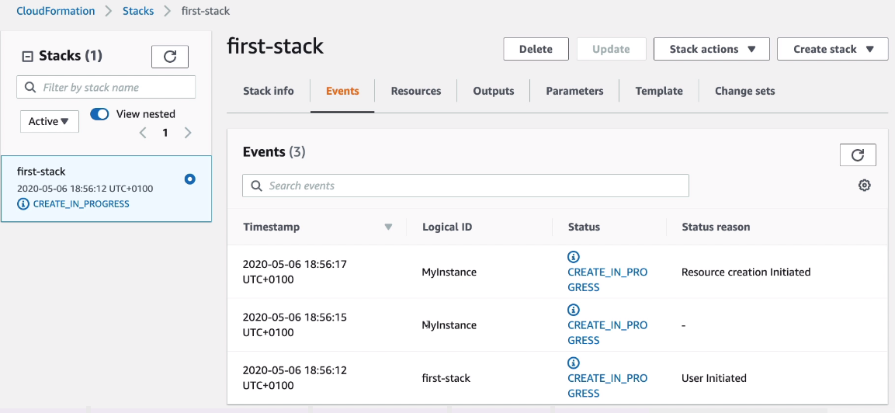
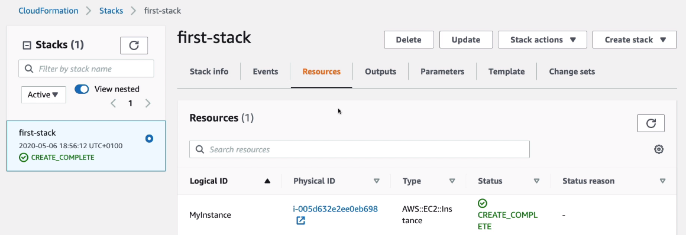

# CloudFormation Create Stack Hands On

We are going to create a simple EC2 instance. Then we're going to create an Elastic IP, 2 security groups and attach it to it. 

When creating a stack, we can choose from following options.



In this case we can upload a template file or point to one in S3 bucket.

```yml
---
Resources:
    MyInstance:
        Type: AWS::EC2::Instance
        Properties:
            AvailabilityZone: us-east-1a
            ImageId: ami-a4c7edb2
            InstanceType: t2.micro
```

Once we have created a stack, it will create all the resources specified.



In the events tab we'll see what events have been currently triggered.



The resources tab will show all the resources that has been created by the CloudFormation Stack.



