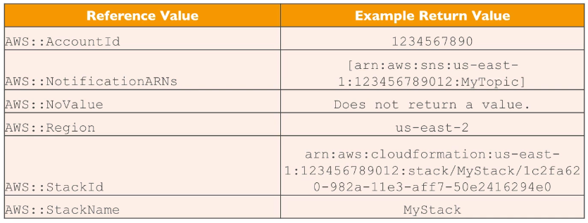

# CloudFormation Parameters

- Parameters are a way to provide inputs to your AWS CloudFormation template
- They're important to know about if:
    - You want to reuse your templates across the company
    - Some inputs can not be determined ahead of time
- Parameters are extremely powerful, controlled, and can prevent errors from happening in your template thanks to types.

## When should you use a parameter?

- Ask yourself this:
    - Is this cloudformation resource configuration likely to change in the future?
    - If so, make it a parameter
- You won't have to re-upload a template to change it's content

```yml
Parameters:
    SecurityGroupDescription:
        Description: Security Group Description
        Type: String
```

## Parameter Settings

Parameters can be controlled by all these settings.

- Type
    - String
    - Number
    - CommaDelimitedList
    - List<Type>
    - AWS Parameter (to help catch invalid values - match against existing values in the AWS Account)
- Description
- Constraints
- ConstraintDescription (String)
- Min/MaxLength
- Min/MaxValue
- Defaults
- AllowedValues (array)
- AllowedPattern (regexp)
- NoEcho (boolean)

## How to Reference a Parameter

- The Fn::Ref function can be leveraged to reference parameters
- Parameters can be used anywhere in a template
- The shorthand for this in YAML is !Ref
- The function can also reference other elements within the template

```yml
DbSubnet1:
    Type:: AWS::EC2::Subnet
    Properties:
        VpcId: !Ref MyVPC
```

## Pseudo Parameters

- AWS offers us pseudo parameters in any CloudFormation template
- These can be used at any time and are enabled by default

