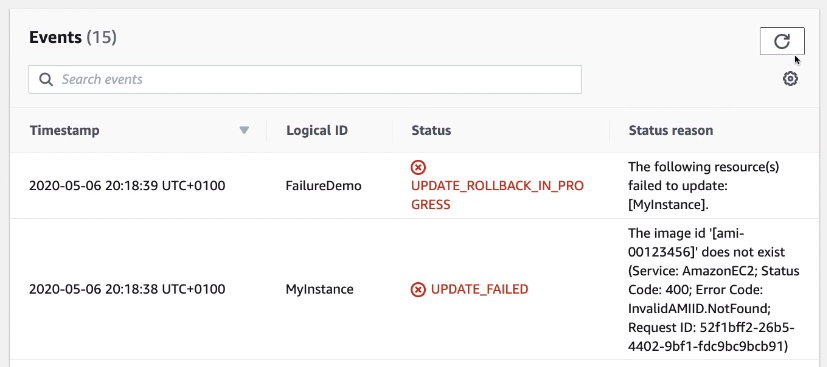
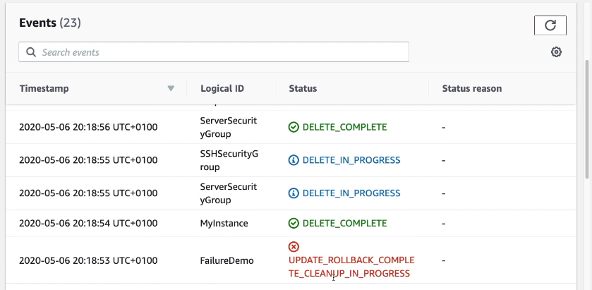
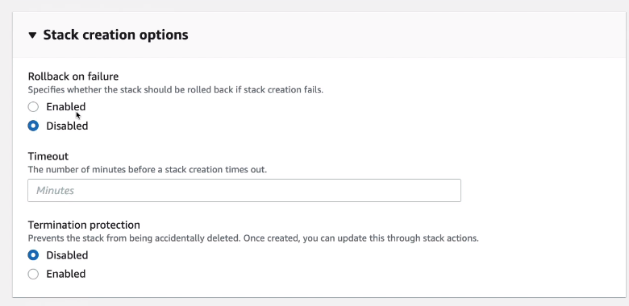

# CloudFormation Rollbacks

- Stack Creation Fails:
    - Default: everything rolls back (gets deleted). We can look at the log
    - Option to disable rollback and troubleshoot what happened
- Stack Update fails:
    - The stack automatically rolls back to the previous known working state
    - Ability to see in the log what happened and error message

To prevent this, you can change the options when importing the template:

