# CloudWatch Logs Hands On

If we open up CloudWatch Logs, we can see multiple Log groups.

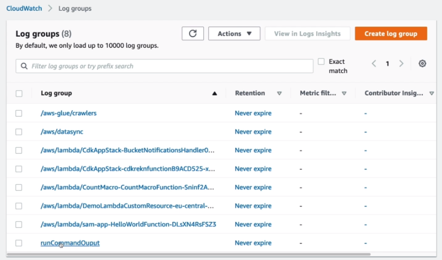

If we open one up, we can see all the log streams related to it.

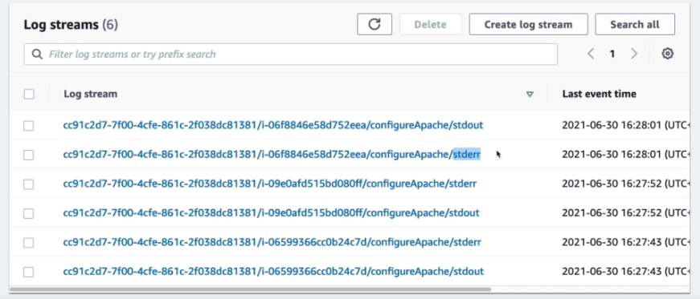

And, when opening up a log stream, we can see all the events.

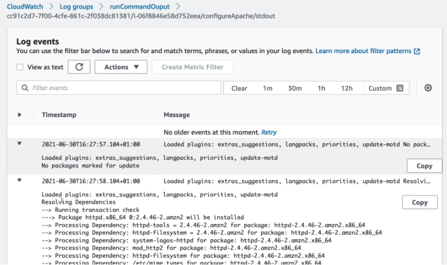

We can use the search bar to filter the log lines, e.g. containing HTTP.

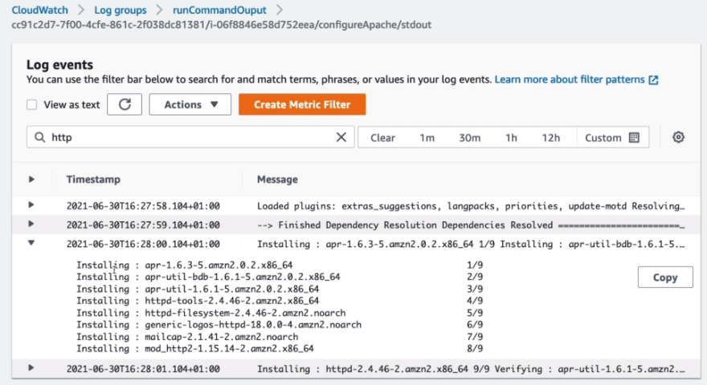

---

## Creating Metric Filters

### Creating Filter pattern

- Test the filter pattern on a dataset.

### Assign metric

## Review & Create

---

## Creating Subscription Filters

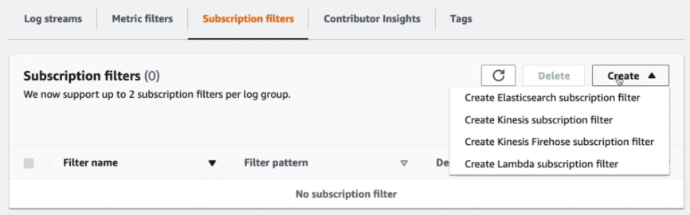

## Edit retention settings

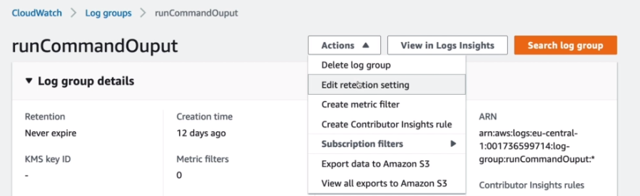

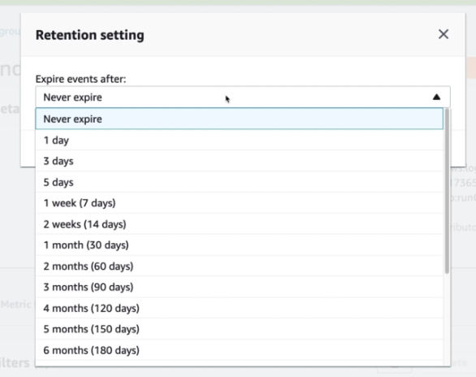

## Export to Amazon S3

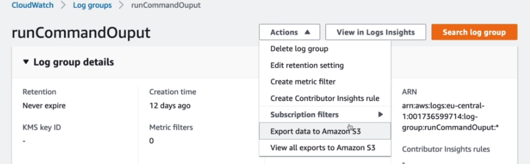

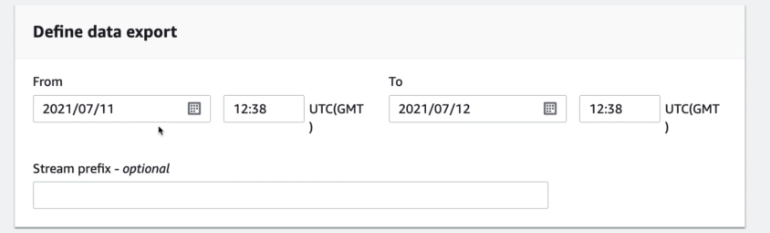

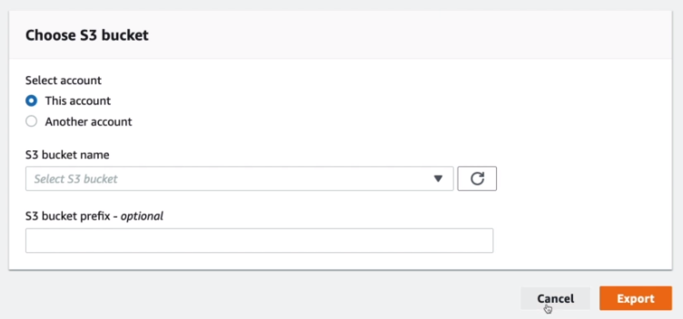

## Create Log Group

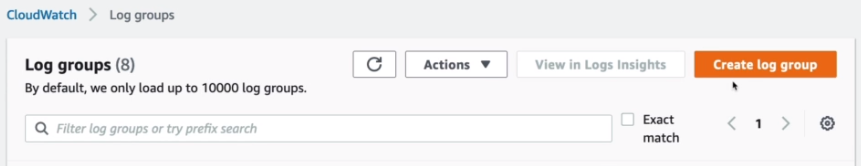

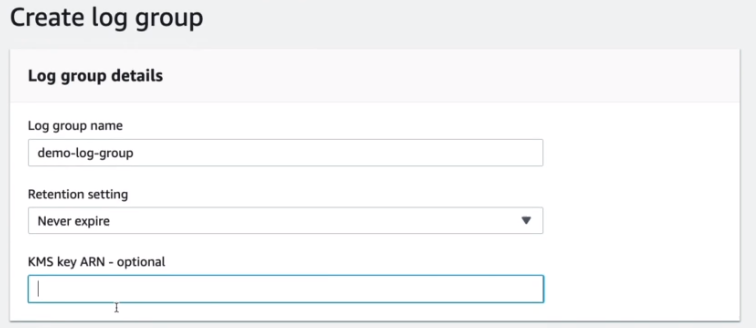

You can setup the retention settings and the KMS ARN if you want the logs to be encrypted.

## Log insights

You can also use Logs Insights to query the logs with a query languange and visusualize it.

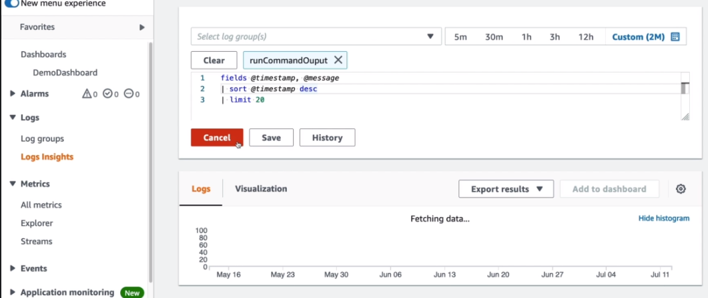

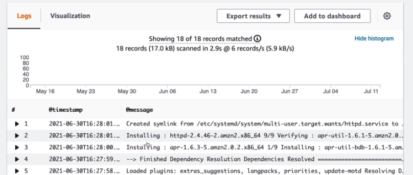

You can also export the results.

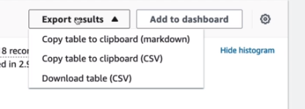

And save the queries on the right side or look up some queries.

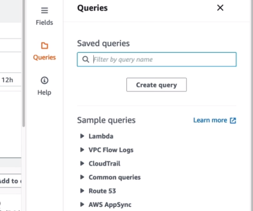

