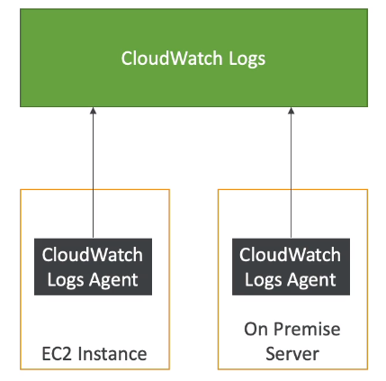

# CloudWatch Agent & CloudWatch Logs Agent

## CloudWatch Logs for EC2

- By default, no logs from your EC2 machine will go to CloudWatch
- You need to run a CloudWatch agent on EC2 to push the log files you want
- Make sure IAM permissions are correct
- The CloudWatch log agent can be setup on-premises too

## CloudWatch Logs Agent & Unified Agent

- For virtual servers (EC2 instances, on-premise servers)
- CloudWatch Logs Agent
    - Old version of the agent
    - Can only send to CloudWatch Logs
- CloudWatch Unified Agent
    - Collect additional system-level metrics such as RAM, processes, etc
    - Collect logs to send to CloudWatch Logs
    - Centralized configuration using SSM Parameter Store

## CloudWatch Unified Agent - Metrics

- Collected directly on your Linux Server / EC2 instance

- CPU (active, guest, idle, system, user, steal)
- Disk metrics (free, used, total), Disk IO (writes, reads, bytes, iops)
- RAM (free, inactive, used, total, cached)
- Netstat (number of TCP and UDP connections, net packets, bytes)
- Processes (total, dead, bloqued, idle, running, sleep)
- Swap Space (free, used, used %)

- Reminder: out-of-the-box metrics for EC2 - disk, CPU, network (high level)