# CloudWatch Logs Metric Filters

- CloudWatch Logs can use filter expressions
    - For example, find a specific IP inside of a log
    - Or count occurrences of "ERROR" in your logs
    - Metric filters can be used to trigger alarms
- **Filters do not retroactively filter data. Filters only publish the metric data points for events that happen after the filter was created.**

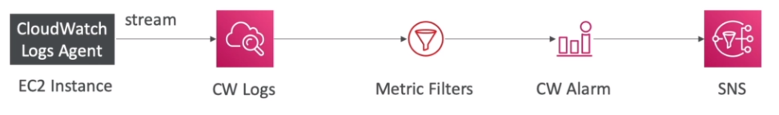

## Creating Metric Filters

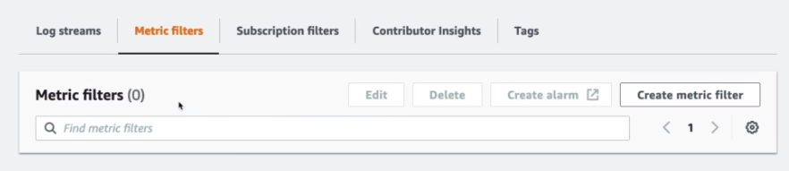

### Creating Filter pattern

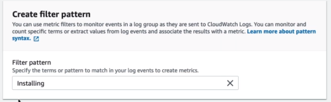

- Test the filter pattern on a dataset.

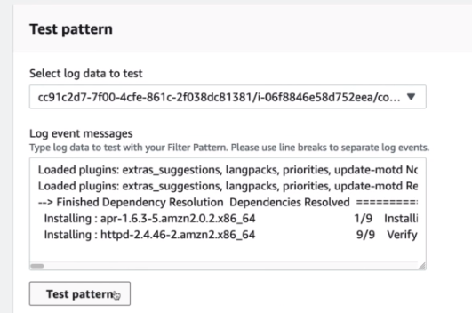
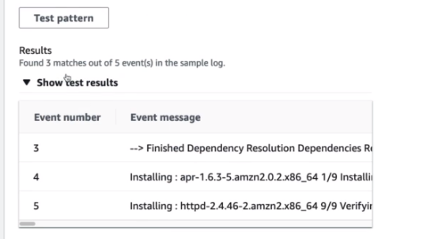

### Assign metric

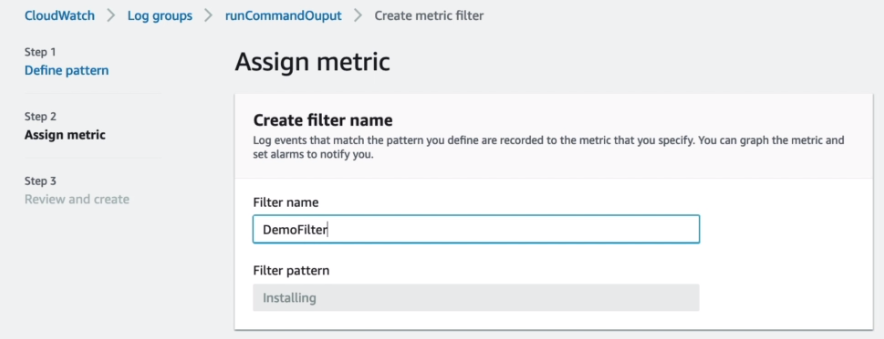

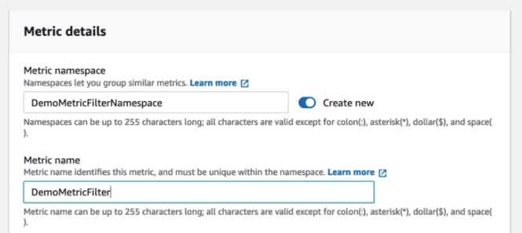

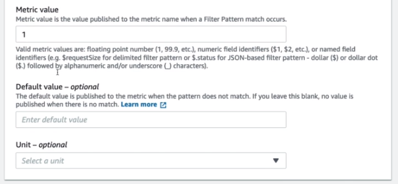

## Review & Create

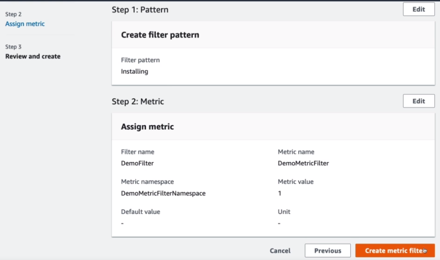

---

When that's done, after some time, when new logs have came in with the specific criteria - a new Custom Namespace should show up under metrics.

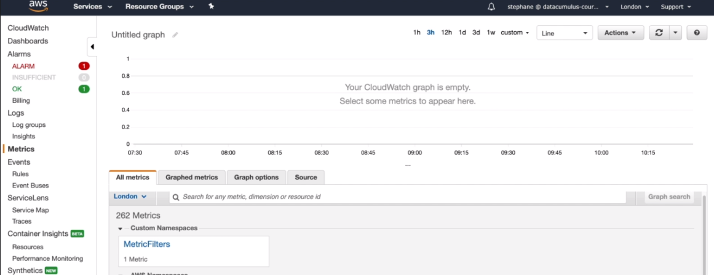

We can also use this metric to create a CloudWatch Alarm

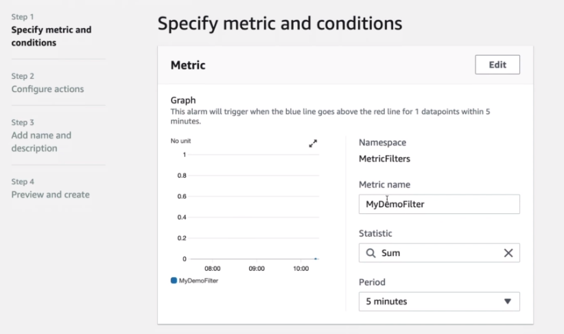

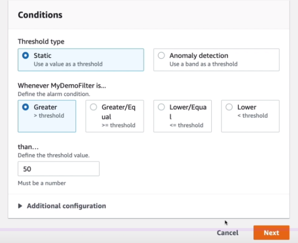

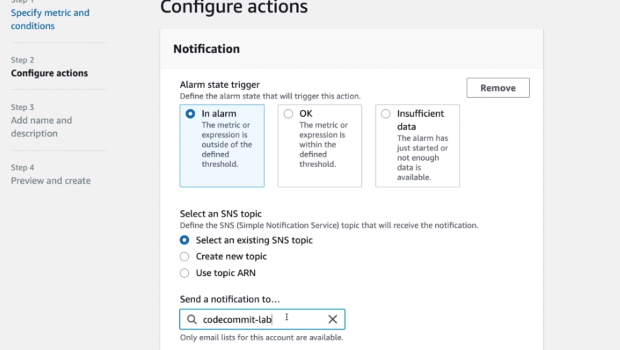

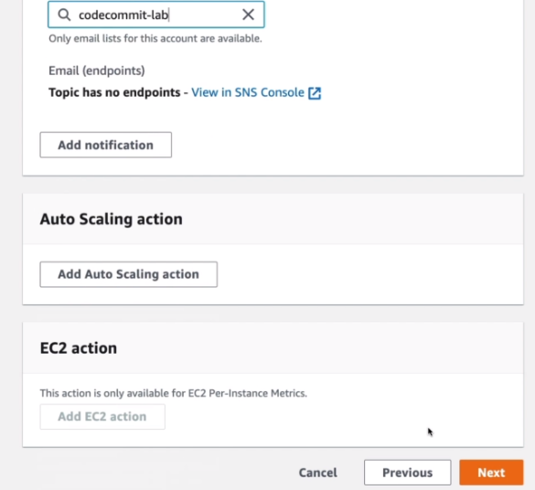

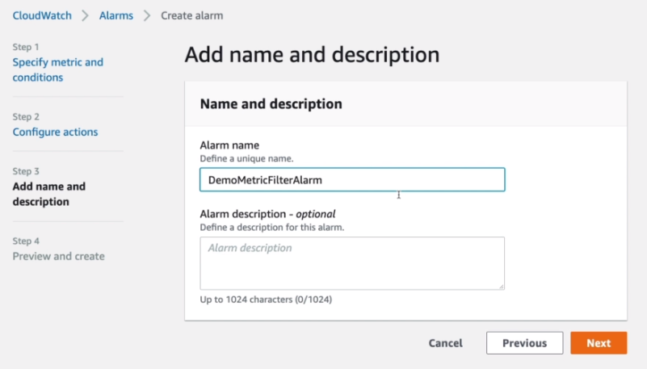

Once it's created we'll see it under alarms.

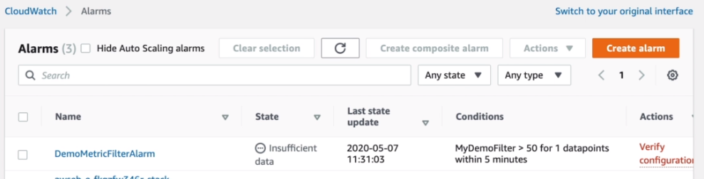

Under metric filters we'll also see that it's linked to an alarm

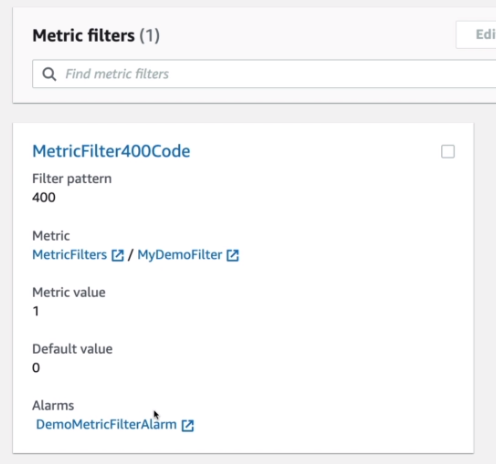