# CloudWatch Alarms Hands On

We are going to create an EC2 instance. We are going terminate the instance if the CPU goes to 100%.

We are going to create the alarm.

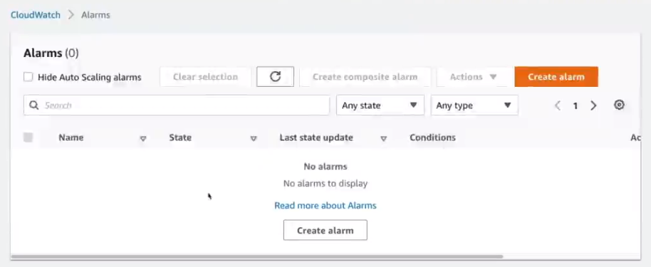

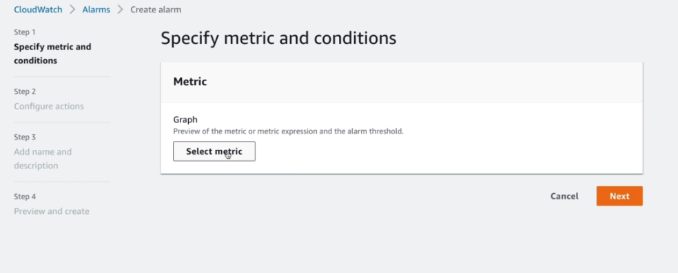

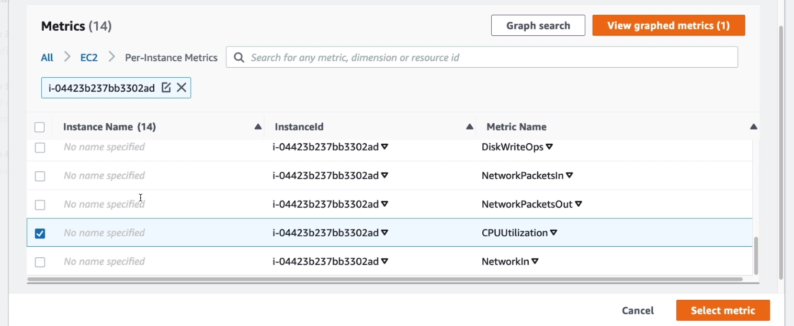

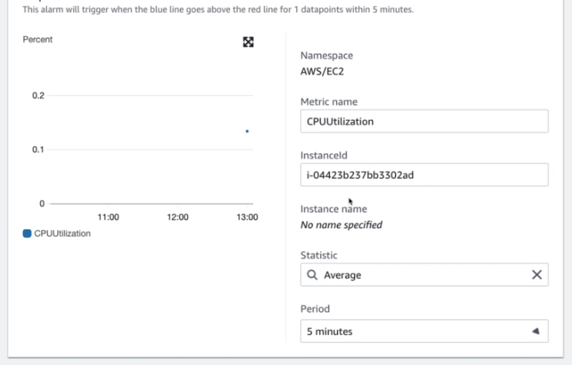

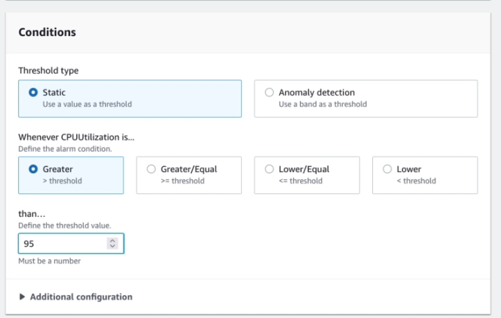

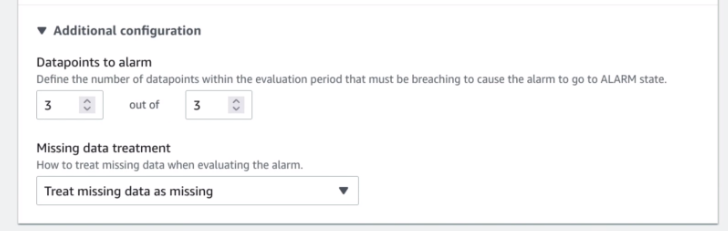

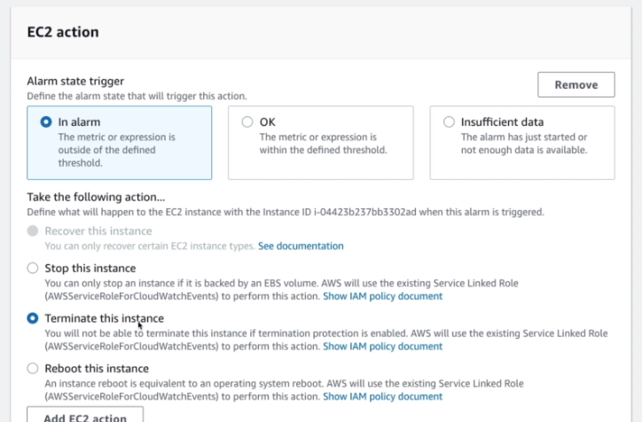

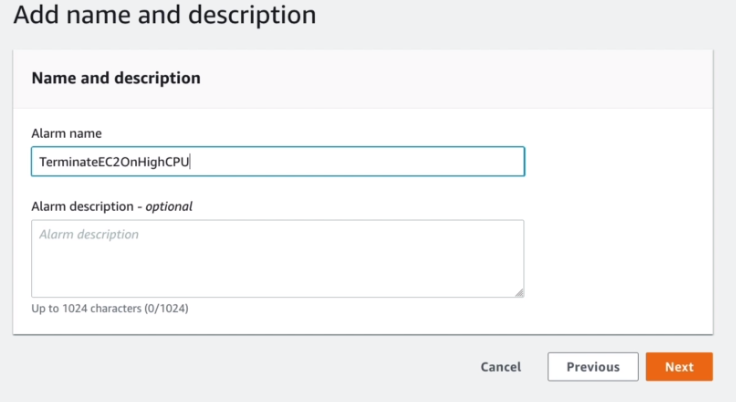

So, we set an alarm to terminate the EC2 instance if it's CPU usage is over 95% for 15minutes.

Because it will take a long time and we need to simulate the CPU workload for that, we are just going to use a CLI command to trigger the alarm.

```console
$ aws cloudwatch set-alarm-state --alarm-name TerminateEC2OnHighCPU --state-value ALARM --state-reason "Testing"
```

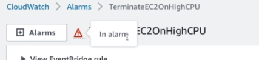

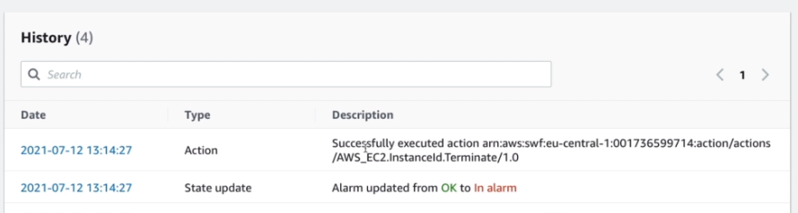

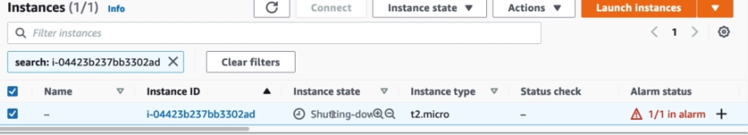

