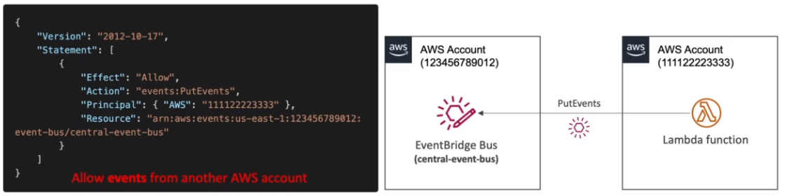

# Amazon EventBridge

- EventBridge is the next evolution of CloudWatch Events
- Default Event Bus - generated by AWS services (CloudWatch Events)
- Partner Event Bus - receive events from Saas service or applications (Zendesk, DataDog, Segment, Auth0...)
- Custom Event Buses - for your own applications
- Event buses can be accessed byh other AWS accounts
- You can archive events (all/filter) sent to an event bus (indefinitely or set period)
- Ability to replay archived events

- Rules: how to process the events (like CloudWatch Events)

## Schema Registry

- EventBridge can analyze the events in your bus and infer the schema
- The Schema Registry allows you to generate code for your application, that will know in advance how data is structured in the event bus
- Schema can be versioned.

## Resource-based Policy

- Manage permissions for a specific Event Bus
- Example: allow/deny events from another AWS account or AWS region
- Use case: aggregate all events from your AWS Organization in a single AWS account or AWS region

## Amazon EventBridge vs CloudWatch Events

- Amazon EventBridge builds upon and extends CloudWatch Events
- It uses the same service API and endpoint, and the same underlying service infrastructure
- EventBridge allows extension to add event buses for your custom applications and your third-party SaaS apps.
- Event Bridge has the Schema Registry capability
- EventBridge has a different name to mark the new capabilities
- Over time, the  CloudWatch Events name will be replaced with EventBridge

