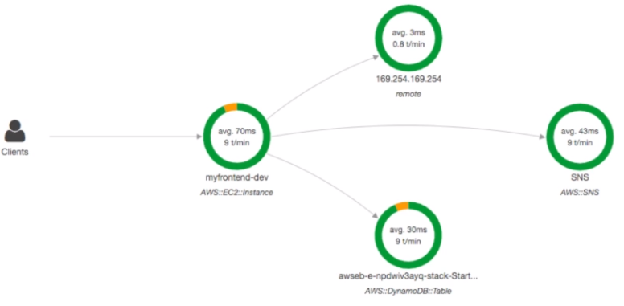
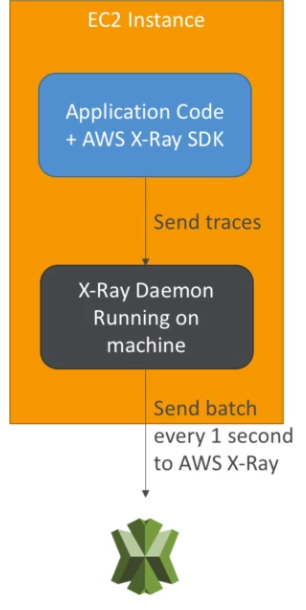

# X-Ray Overview

- Debugging in Production, the good old way:
    - Test locally
    - Add log statements everywhere
    - Re-deploy in production
- Log formats differ across applications using CloudWatch and analytics is hard
- Debugging: monolith "easy", distributed services "hard"
- No common views of your entire architecture
- Enter... AWS X-Ray!

## Visual analysis of our applications

## X-Ray advantages

- Troubleshooting performance (bottlenecks)
- Understand dependencies in a microservice architecture
- Pinpoint service issues
- Review request behavior
- Find errors and exceptions
- Are we meeting time SLA?
- Where I am throttled?
- Identify users that are impacted

## X-Ray compatibility

- AWS Lambda
- Elastic Beanstalk
- ECS
- ELB
- Api Gateway
- EC2 Instances or any application server (even on premise)

## AWS X-Ray Leverages Tracing

- Tracing is an end to end way to following a request
- Each component dealing with the request adds its own trace
- Tracing is made of segments (+ sub segments)
- Annotations can be added to traces to provide extra-information
- Ability to trace:
    - Every request
    - Sample request (as % for example or a rate per minute)
- X-Ray Security
    - IAM for authorization
    - KSM for encryption at rest

## How to enable it?

1. Your code (Java, Python, Go, Node.js, .NET) must import the AWS X-Ray SDK
    - Very little code modification needed
    - The applications SDK will then capture
        - Calls to AWS services
        - HTTP / HTTPS requests
        - Database calls (MySQL, PostgreSQL, DynamoDB)
        - Queue calls (SQS)
2. Install the X-Ray daemon or enable X-Ray AWS integration
    - X-Ray daemon works as a low level UDP packet interceptor (Linux / Window / Mac...)
    - AWS Lambda / other AWS services alreeady run the X-Ray daemon for you
    - Each application must have the IAM rights to write data to X-Ray

## The X-Ray magic

- X-Ray service collects data from all the different services
- Service mapo is computed from all the segments and traces
- X-Ray is graphical, so even non technical people can troubleshoot

## Troubleshooting

- If X-Ray is not working on EC2
    - Ensure the EC2 IAM Role has the proper permissions
    - Ensure the EC2 instance is running the X-Ray Daemon
- To enable on AWS Lambda:
    - Ensure it has an IAM execution role with proper policy (AWSX-RayWriteOnlyAccess)
    - Ensure that X-Ray is imported in the code