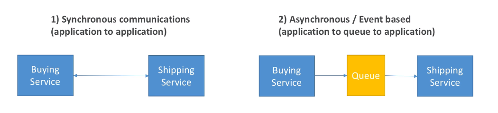

# Introduction to Messaging

- When we start deploying multiple applications, we will inevitably need to communicate with one another
- There are two patterns of application communication - synchronous and asynchronous (event based).

- Synchronous communication between applications can be problematic if there are sudden spikes of traffic
- What if you need to suddenly encode 1000 videos but usually it's 10?

- In that case, it's better to decouple your applications
    - using SQS, queue model
    - using SNS: pub/sub model
    - using Kinesis: real-time streaming model

- These services can scale independently from our application