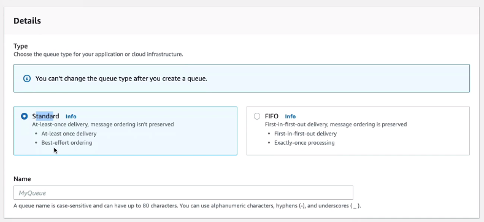
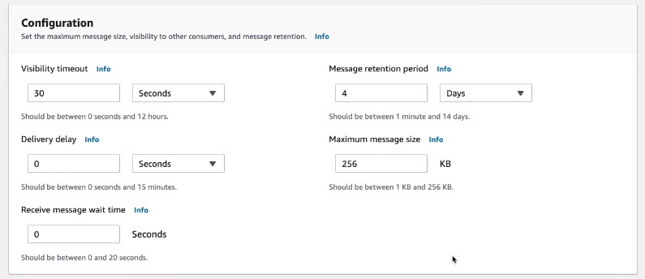
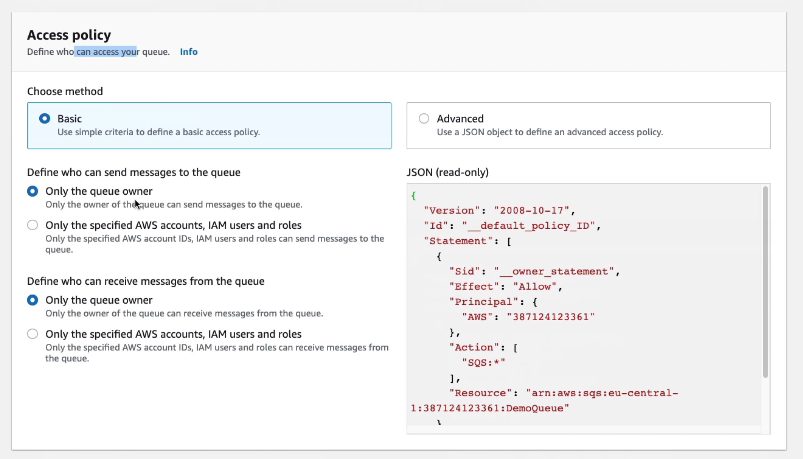
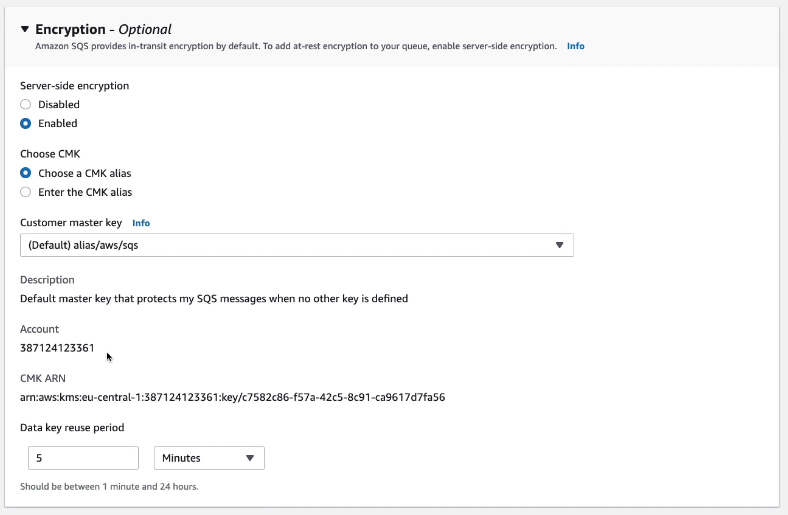
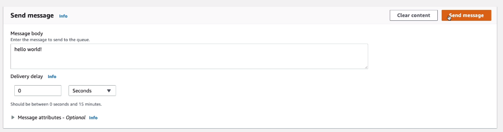
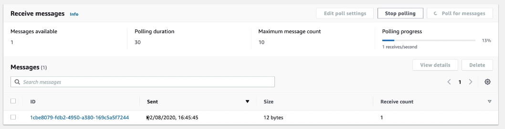
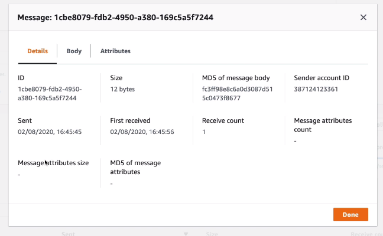
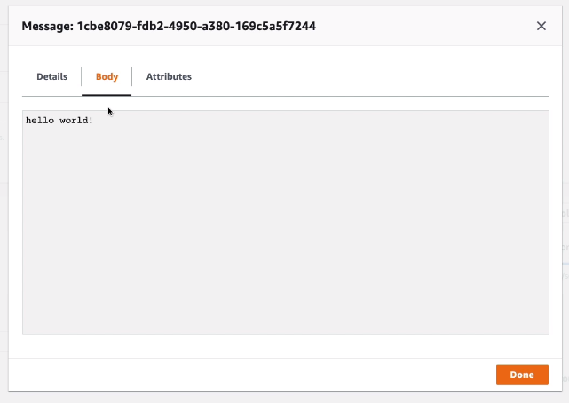

# SQS Standard Queue Hands On

We are going to create a new queue

Now the queue is created, we can send and receive messages from it.
Click on Send and Receive messages when opening up the queue.

Each time you poll, the receive count for the message will increase, but it will still persist in the queue. When you are done with the message - delete it.

You can also purge the queue - it will remove all the messages in the queue. But that might not be a good idea in production.

