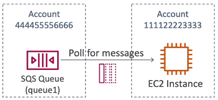
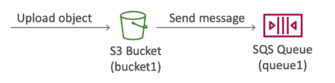
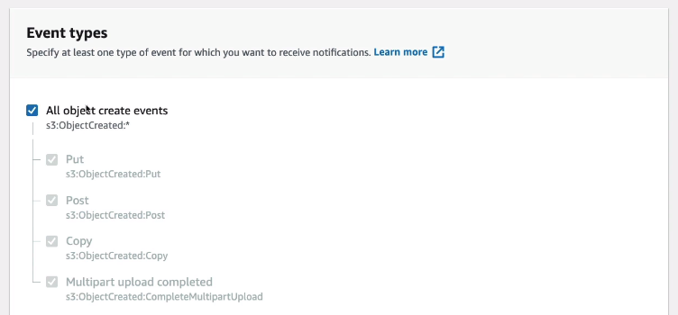
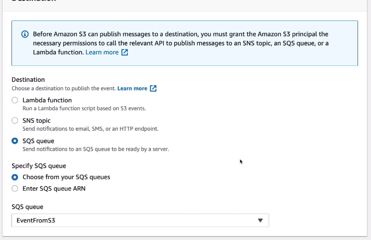
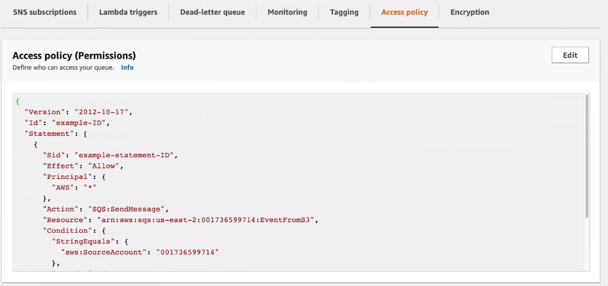
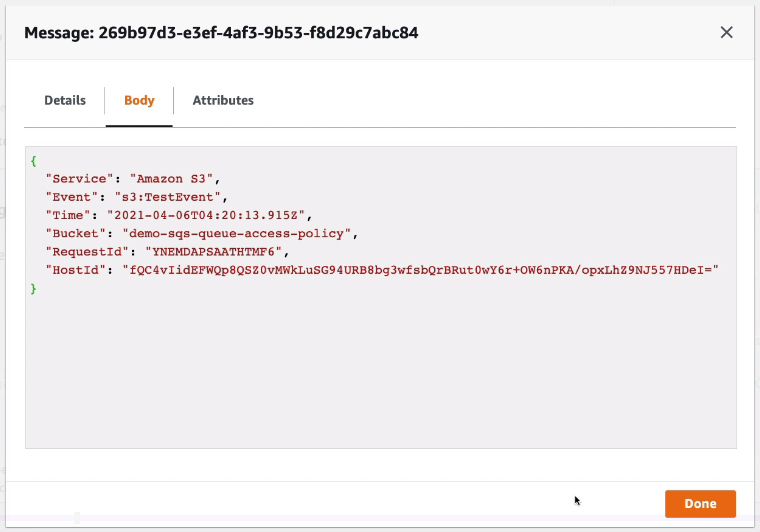

# SQS Queue Access Policy

## Cross Account



```json
{
    "Version": "2012-10-17",
    "Statement": [{
        "Effect": "Allow",
        "Principal": {"AWS": [111122223333]},
        "Action": ["sqs:ReceiveMessage"],
        "Resource": "arn:aws:sqs:us-east-1:4444555666:queue1"
    }]
}
```

## Publish S3 Event Notifications to SQS Queue



```json
{
    "Version": "2012-10-17",
    "Statement": [{
        "Effect": "Allow",
        "Principal": {"AWS": "*"},
        "Action": ["sqs:SendMessage"],
        "Resource": "arn:aws:sqs:us-east-1:4444555666:queue1",
        "Condition": {
            "ArnLike": {"aws:SourceArn": "arn:aws:s3:*:*:bucket1"},
            "StringEquals": {"aws:SourceAccount":"<bucket1_owner_account_id"}
        }
    }]
}
```

When creating an S3 bucket:





In SQS:



