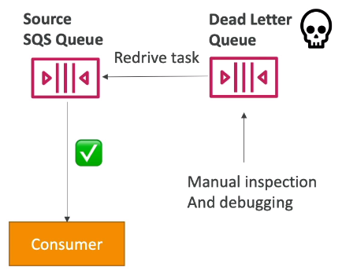
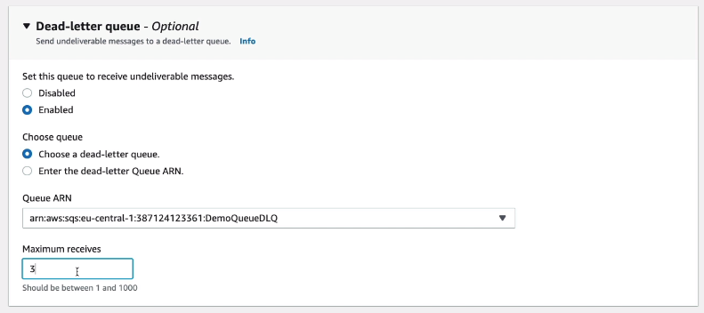

# SQS - Dead Letter Queues

- If a consumer failts to process a message within the Visibility Timeout - the message goes back to the queue.
- We can set a threshold of how many times a message can go back to the queue.
- After the *MaximumReceives* threshold is exceeded, the message goes into a dead letter queue (DLQ)

- Useful for debugging
- Make sure to process the messages in the DLQ before they expire
    - Good to set a retention to 14 days in the DLQ

## Redrive to Source

- Feature to help consume messages in the DLQ to understand what is wrong with them
- When our code is fixed, we can redrive the messages from the DLQ back into the source queue (or any other queue) in batches wihout writing custom code.

