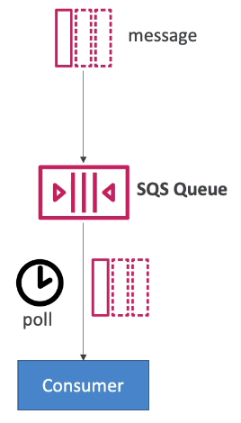
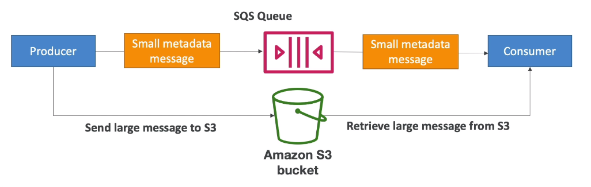

# SQS - Certified Developer Concepts

## Long Polling

- When a consumer requests messages from the queue, it can optionally "wait" for messages to arrive if there are none in the queue
- This is called Long Polling
- LongPolling decreases the number of API calls made to SQS while increasing the efficiency and latency of your application.
- The wait time can be between 1 sec to 20 sec (20 sec preferable).
- Long polling is preferable to Short Polling
- Long polling can be enabled at the queue level or at the API level using `WaitTimeSeconds`.

## Extended Client

- Message size is 256KB, how to send large messages, e.g. 1GB?
- Using the SQS Extended Client (Java Library)

## Must know API

- CreateQueue (MessageRetentionPeriod), DeleteQueue
- PurgeQueue: delete all the messages in the queue
- SendMessage (DelaySeconds), ReceiveMessage, DeleteMessage
- MaxNumberOfMessages: default 1, max 10 (for ReceiveMessage API)
- ReceiveMessageWaitTimeSeconds: Long Polling
- ChangeVisibility: change the message timeout
- Batch APIs for SendMessage, DeleteMessage, ChangeMessageVisibility helps decrease your costs.

