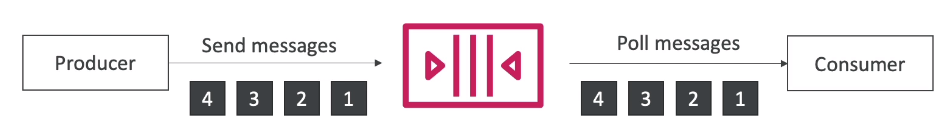
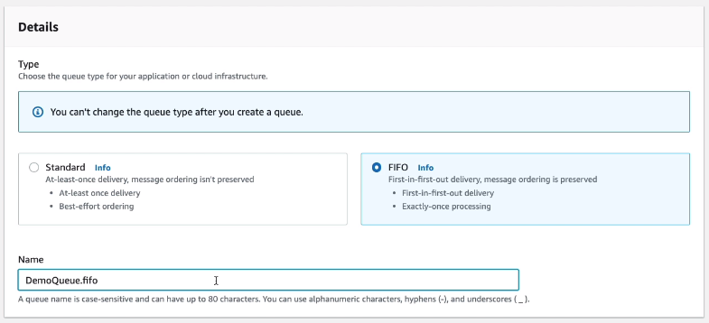

# Amazon SQS - FIFO Queue

- FIFO - First In First Out (ordering messages in the queue)

- Limited throughput: 300msg/s without matching, 3000 msg/s with batching
- Exactly-once send capability (by removing duplicates)
- Messages are processed in order by the consumer

You have to end the queue name with `.fifo`.

