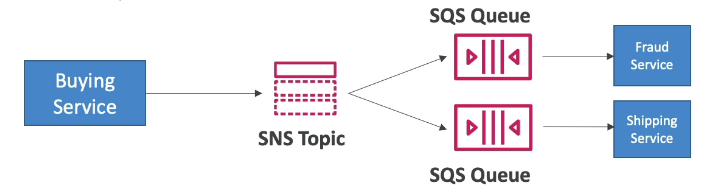
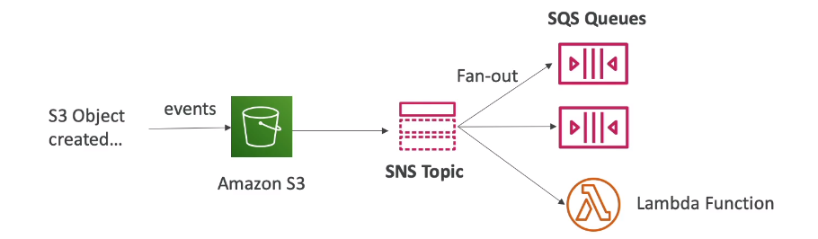
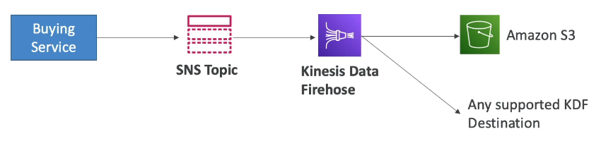
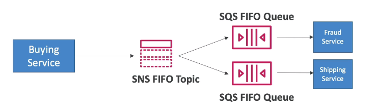
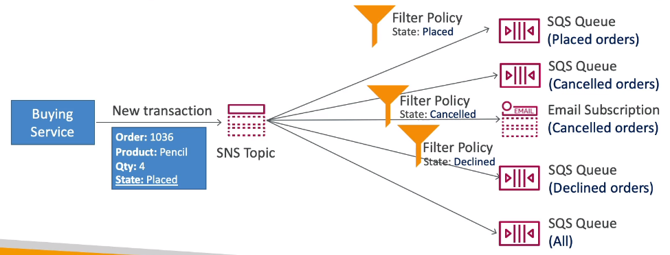

# SNS + SQS: Fan Out

- Push once in SNS, receive all in all SQS queues that are subscribers
- Fully decoupled, no data loss
- SQS allows for: data persistence, delayed processing and retries of work
- Ability to add more SQS subscribers over time
- Make sure your SQS queue access policy allows for SNS to write

## Application: S3 Events to multiple queues

- For the same combination of: event type (e.g. object create) and prefix (e.g.images/) you can only have one S3 Event Rule.
- If you want to send the same S3 event to many SQS queues, use fan-out

## Application: SNS to Amazon S3 through Kinesis Data Firehose

- SNS can send to Kinesis and therefore we can have the following solutions architecture:

## FIFO Topic

- FIFO - First In First Out (ordering of messages in the topic)
- Similar features as SQS FIFO
    - Ordering by Message Group ID (all messages in the same group are ordered)
    - Deduplication using a Deduplication ID or Content Based Deduplication
- **Can only have SQS FIFO queus as subscribers**
- Limited throughput (same as thoughput as SQS FIFO)

## SNS FIFO + SQS FIFO: Fan Out

## SNS - Message Filtering

- JSON policy used to filter messages sent to SNS topic's subscriptions
- If a subscription doesn't have a filter policy, it receives every message

