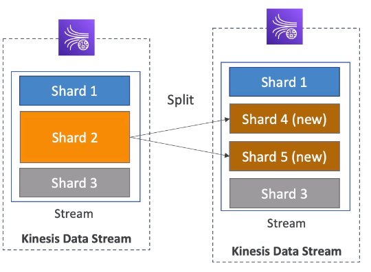
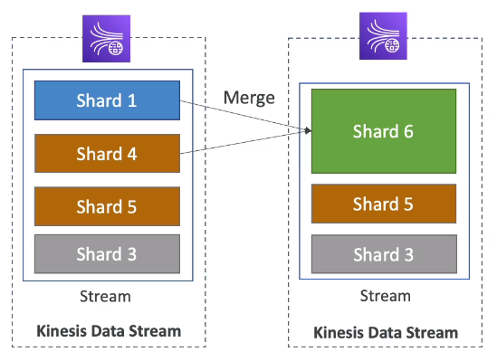

# Kinesis Operations

## Shard Splitting

- Used to increase the Stream capacity (1 MB/s data in per shard)
- Used to divide a "hot shard"
- The old shard is closed and will be deleted once the data is expired
- No automatic scaling (manually increase/decrease capacity)
- Can't split into more than two shards in a single operation

## Merging Shards

- Decrease the Stream Capacity and save costs
- Can be used to group two shards with low traffic (cold shards)
- Old shards are closed and will be deleted once the data is expired
- Can't merge more than two shards in a single operation

