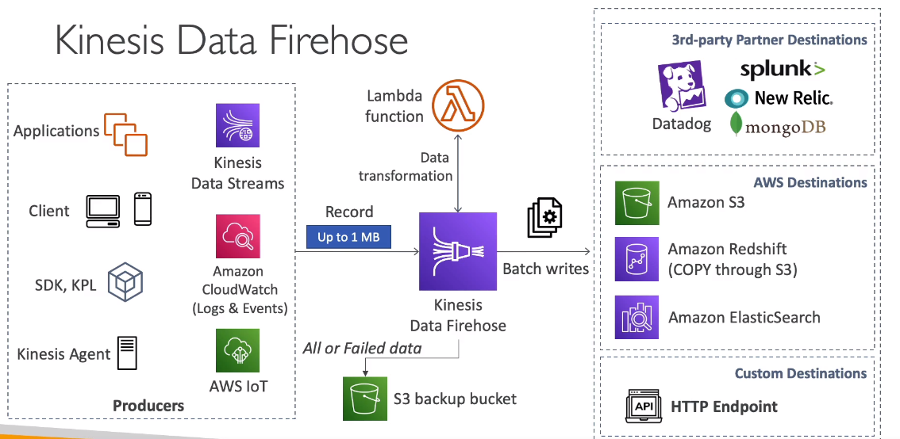

# Kinesis Data Firehose

- Fully Managed Service, no administration, automatic scaling, serverless
    - AWS: Redshift / Amazon S3 / ElasticSearch
    - 3rd part partner: Splunk / MongoDB / DataDog / NewRelic / ...
    - Custom: send to any HTTP endpoint
- Pay for data going through Firehose
- Near Real Time
    - 60 seconds latency minumum for non full batches
    - or minumum 32 MB of data at a time
- Supports many data formats, conversions, transformations, compression
- Supports custom data transformations using AWS Lambda
- Can send failed or all data to backup S3 bucket

## Kinesis Data Streams vs Firehose

- Kinesis Data Streams
    - Streaming service for ingest at scale
    - Write custom code (producer / consumer)
    - Real-time (~200ms)
    - Manage scaling (shard splitting / merging)
    - Data storage for 1 to 365 days
    - Supports replay capability
- Kinesis Data Firehose
    - Load streaming data into S3 / Redshift / ES / 3rd party / Custom HTTP
    - Fully managed
    - Near real-time (buffer time min 60 sec)
    - Automatic scaling
    - No data storage
    - Doesn't support replay capability