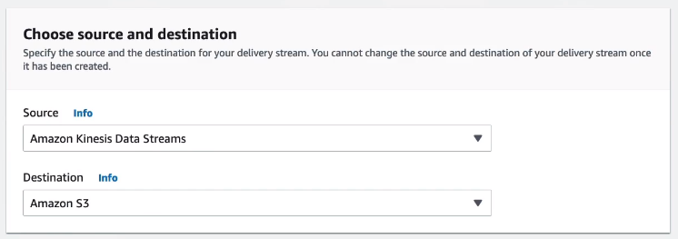
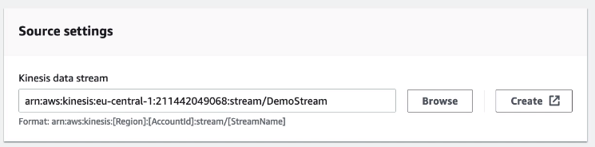
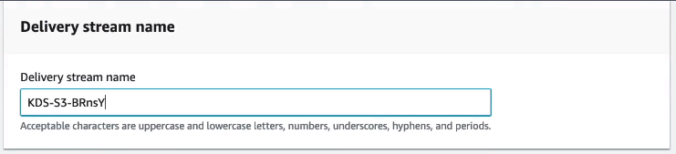
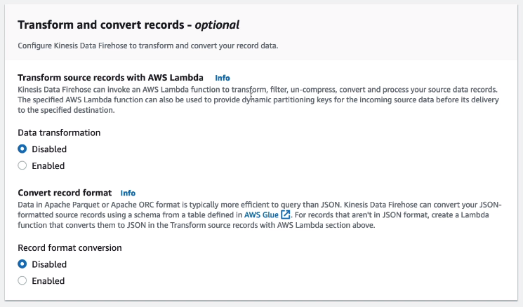
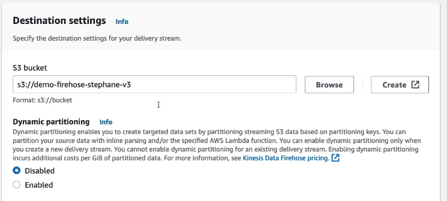
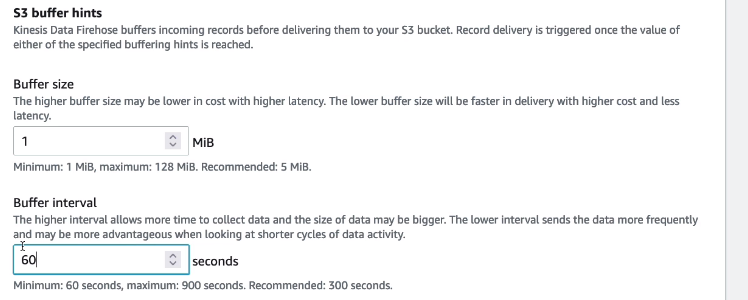
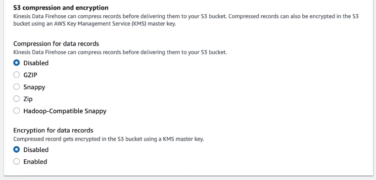
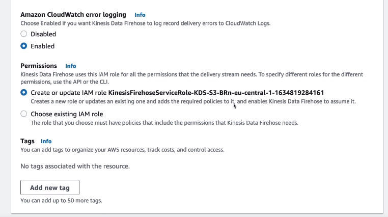

# Kinesis Data Firehose Hands On

We are going to create a new data stream.

We have an option to trasform the records with AWS Lambda before they are being delivered by Firehose. Also, we have an option to transform the record format into Apache Parquet or Apache ORC.

Next, we are setting the destination

Under the additional settings we can configure the buffer size it will wait to fill as well as the interval. For example, it will wait until it fills 1MB buffer or times out at 60 seconds and then writes it into S3.

---

