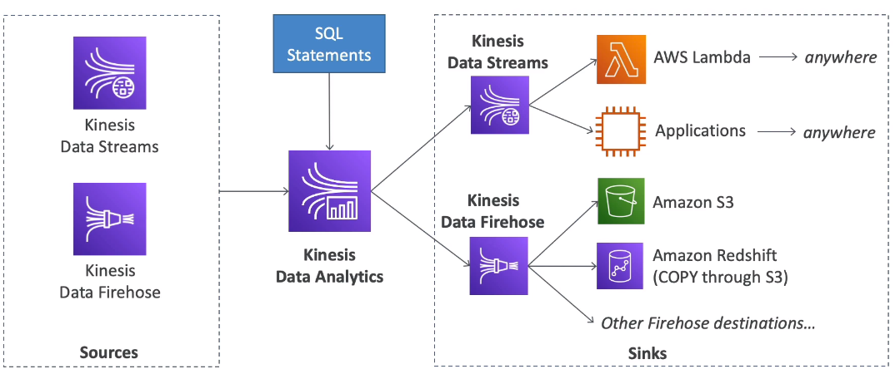

# Kinesis Data Analytics

- Perform real-time analytics on Kinesis Streams using SQL
- Fully managed, no servers to provision
- Automatic scaling
- Real-time analytics
- Pay for actual consumption rate
- Can create streams out of real-time queries
- Use cases:
    - Time-series analytics
    - Real-time dashboards
    - Real-time metrics

## SQS

- Consumer "pull data"
- Data is deleted after being consumed
- Can have as many workers (consumers) as we want
- No need to provision throughput
- Ordering guarantees only on FIFO queues
- Individual message delay capability

## SNS

- Push data to many subscribers
- Up to 12,500,000 subscribers
- Data is not persisted (list if delivered)
- Pub/Sub
- Up to 100,000 topics
- No need to provision throughput
- Integrates with SQS for fan-out architecture pattern
- FIFO capability for SQS FIFO

## Kinesis

- Standard: pull data (2MB per shard)
- Enhanced fan-out: push data(2MB per shard per consumer)
- Possibility to replay data
- Meant for real-time big data, analytics and ETL
- Ordering at the shard level
- Data expires after X days
- Provisioned mode or on-demand capacity mode