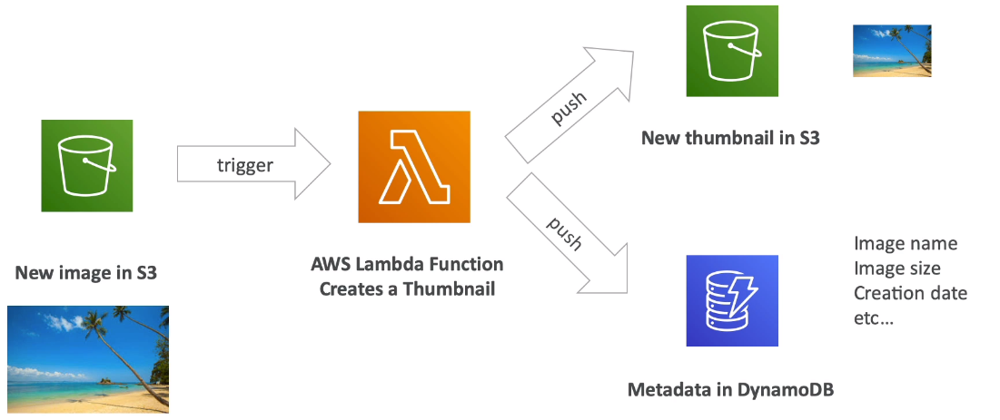
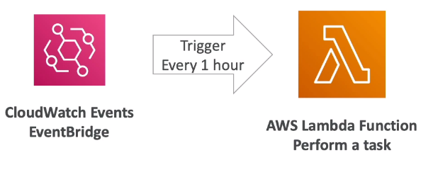

# AWS Lambda Overview

## Why AWS Lambda

- Amazon EC2
    - Virtual Servers in the Cloud
    - Limited by RAM and CPU
    - Continously running
    - Scaling means intervention to add / remove servers
- Amazon Lambda
    - Virtual functions - no servers to manage
    - Limited by time - short executions
    - Run on-demand
    - Scaling is automated

## Benefits of AWS Lambda

- Easy pricing
    - Pay per request and compute time
    - Free tier of 1,000,000 AWS Lambda requests and 400,000 GBs of compute time
- Integrated with the whole AWS suite of services
- Integrated with many programming languages
- Easy monitoring through AWS CloudWatch
- Easy to get more resources per functions (up to 10GB of RAM)
- Increasing RAM will also improve CPU and network

## AWS Lambda language support

- Node.js (JavaScript)
- Python
- Java (Java 8 compatible)
- C# (.NET Core)
- Golang
- C# / Powershell
- Ruby
- Custom Runtime API (community supported, example Rust)

- Lambda Container Image
    - The container image must implement the Lambda Runtime API
    - ECS / Fargate is preferred for running arbitrary Docker images
    - Important: Docker is not for AWS LAmbda, it's for ECS / Fargate

## AWS Lambda Integrations

The main ones are:
- API Gateway
- Kinesis
- DynamoDB
- S3
- CloudFront
- CloudWatch Events / EventBridge
- CloudWatch Logs
- SNS
- SQS
- Cognito

but there are way more

## Example - thumbnail creation with serverless

## Example - serverless CRON job

## AWS Lambda Pricing: example

- You can find overall pricing information here: https://aws.amazon.com/lambda/pricing/
- Pay per calls:
    - First 1,000,000 requests are free
    - $0.20 per 1 million requests thereafter (0.0000002 per request)
- Pay per duration (in iincrement of 1ms)
    - 400,000 GB-seconds of compute time per month is FREE
    - 400,000 seconds if function is 1GB RAM
    - 3,200,000 seconds if function is 128MB RAM
    - After that $1.00 for 600,000 GB-seconds
- It is usually very cheap to run AWS Lambda so it's very popular

