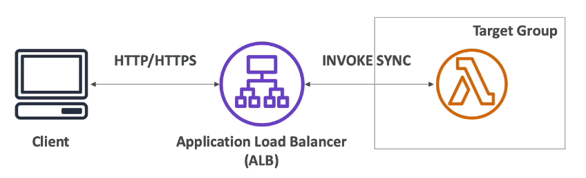

# Lambda Integration with ALB

- To expose a Lambda function as an HTTP(s) endpoint
- You can use the Application Load Balancer (or an API Gateway)
- The Lambda function must be registered in a target group



The HTTPS payload will be provided to Lambda in JSON format

```json
{
    "requestContext": {
        "elb": {
            "targetGroupArn": "arn:aws:elasticloadbalancing:us-east-2:123..."
        }
    },
    "httpMethod": "GET",
    "path": "/lambda",
    "queryStringParameters": {
        "query": "123ABCD"
    },
    "headers": {
        "connection": "keep-alive",
        "host": "lambda-alb...",
        "user-agent": "Mozilla/5.0 ...",
        "x-amzn-trace-id": "Root=1-5c...",
        "x-forwarded-for": "123.123.123.123",
        "x-forwarded-port": "80",
        "x-forwarded-proto": "http"
    },
    "body": "",
    "isBase64Encoded": false
}

The lambda should respond with Json as well

```json
{
    "statusCode": 200,
    "statusDescription": "200 OK",
    "headers": {
        "Content-Type": "text/html; charset=utf-8"
    },
    "body": "<h1>Hello world!</h1>",
    "isBaseEncoded": false
}
```

## ALB Multi-Header Values

- ALB can support multi header values (ALB setting)
- When you enable multi-value headers, HTTP headers and query string parameters that are sent with multiple values are shown as arrays within the AWS Lambda event and response objects.

HTTP:
```
http://example.com/path?name=foor&name=bar
```

JSON:
```
"queryStringParameters": { "name": ["foo", "bar"] }
```