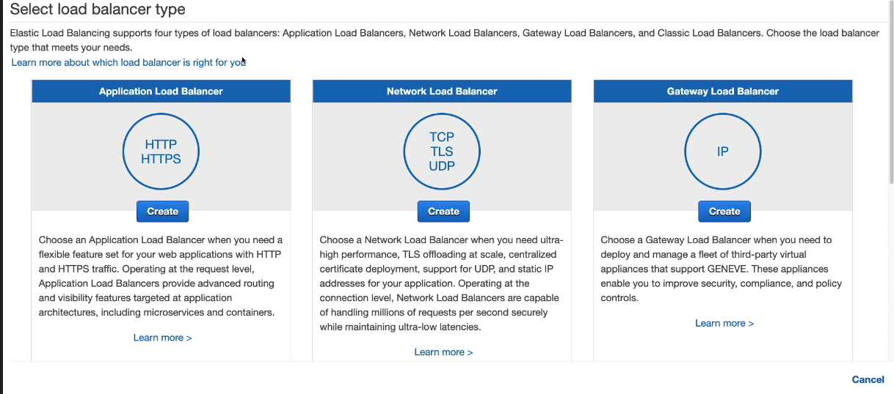
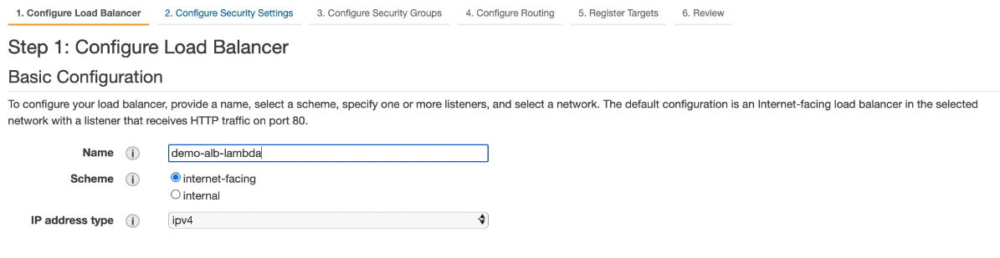
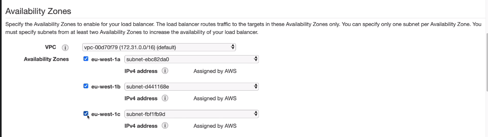
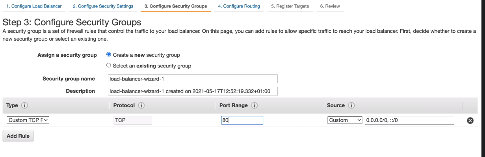
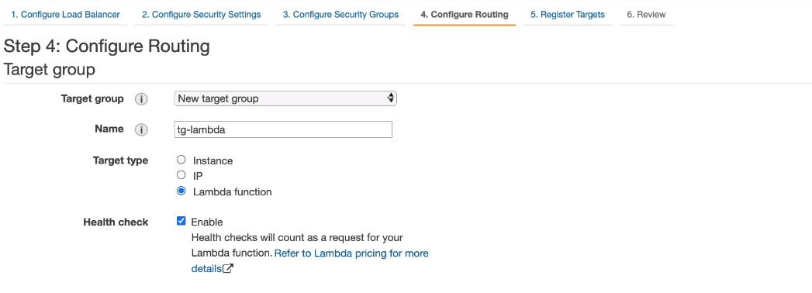
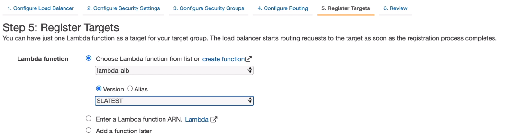
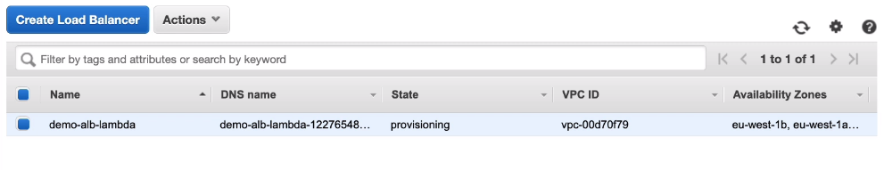
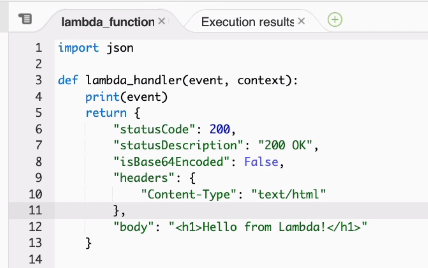
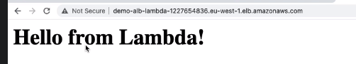

# Lambda & Application Load Balancer Hands On

We are going to create a new function, this time we are choosing `Author from scratch` with a `Python 3.8` runtime.

Once the function is created, we are going to EC2 - Load Balancers and creating a new Application Load Balancer.

We are enabling it across 3 availability zones.

We are going to create a new security group.

Next, in routing we are choosing to create a new target group and target lambda functions.

Next, we are registering the target

If we are to open up the ALB url now, it will download the response JSON file.
In order for it to properly work, we need to change the response format:

Once deployed, it should work properly now:

