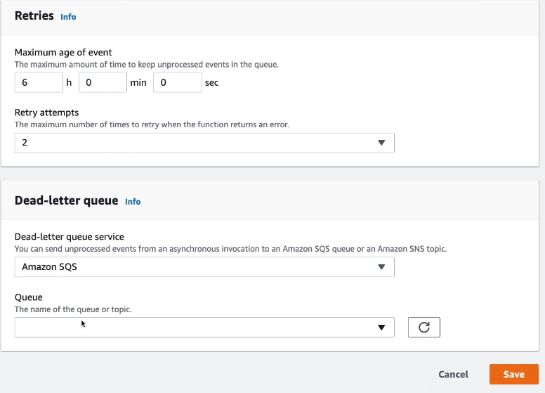
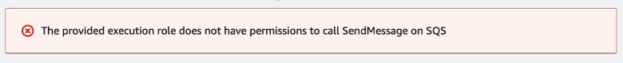

# Lambda Asynchronous Invocations Hands On

We can invoke a function asynchronously via CLI

```console
// Linux / Mac
$ aws lambda invoke --function-name hello-world --cli-binary-format raw-in-base64-out --payload '{"key1": "value1", "key2": "value2", "key3": "value3"}' --invocation-type Event --region eu-west-1 response.json
// Windows Powershell
$ aws lambda invoke --function-name hello-world --cli-binary-format raw-in-base64-out --payload '{\"key1\": \"value1\", \"key2\": \"value2\", \"key3\": \"value3\"}' --invocation-type Event --region eu-west-1 response.json
// Windows CMD
$ aws lambda invoke --function-name hello-world --cli-binary-format raw-in-base64-out --payload '{""key1"": ""value1"", ""key2"": ""value2"", ""key3"": ""value3""}' --invocation-type Event --region eu-west-1 response.json
```

For us to know the result of the invocation we will need to look at the logs.

We can also configure the asynchronous invocation by opening up the lambda `Configuration - Asynchronous invocation`. There we can configure maximum age of the event, retry attempts and a DLQ.



When configuring a DLQ you might see a message about insufficient permissions.



To fix that, we navigate to `Configuration - Permissions`. Then click on the Execution Role and attach a policy to it related to Amazon SQS.