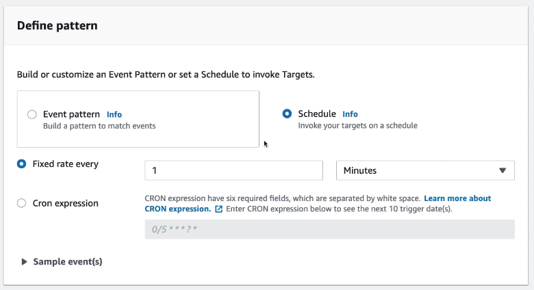
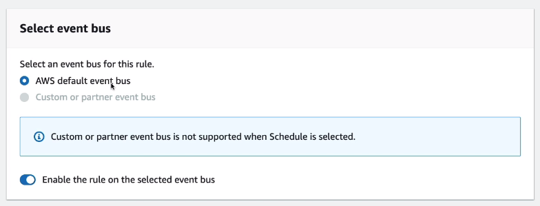
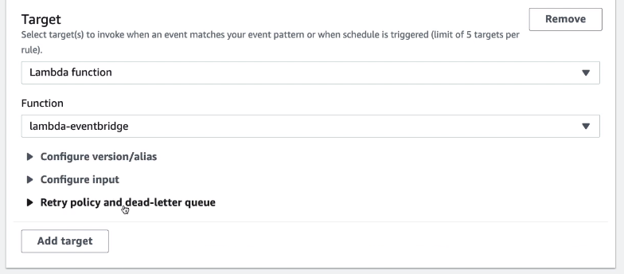

# Lambda & CloudWatch Events / EventBridge Hands On

We are going to create a new rule on EventBridge. It is going to be invoked once every minute.

It will be the default event bus

And the target lambda function.

