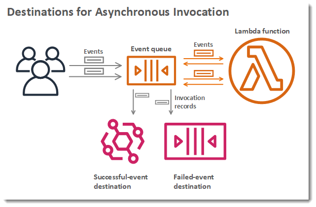
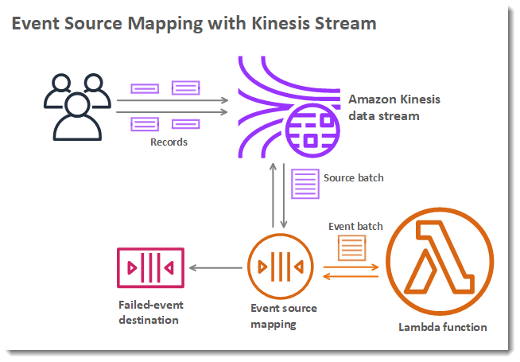

# Lambda - Destinations

- Nov 2019: Can configure to send result to a destination
- Asynchronous invocations - can define destinations for successful and failed event:
    - Amazon SNS
    - Amazon SQS
    - AWS Lambda
    - Amazon EventBridge bus
- Note: AWS recommends you use destinations instead of DLQ now (but both can be used at the same time)
- Event Source mapping: for discarded event batches
    - Amazon SQS
    - Amazon SNS
- Note: you can send events to a DLQ directly from SQS

https://docs.aws.amazon.com/lambda/latest/dg/invocation-async.html

https://docs.aws.amazon.com/lambda/latest/dg/invocation-eventsourcemapping.html