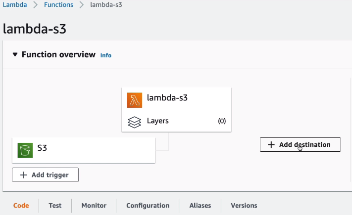
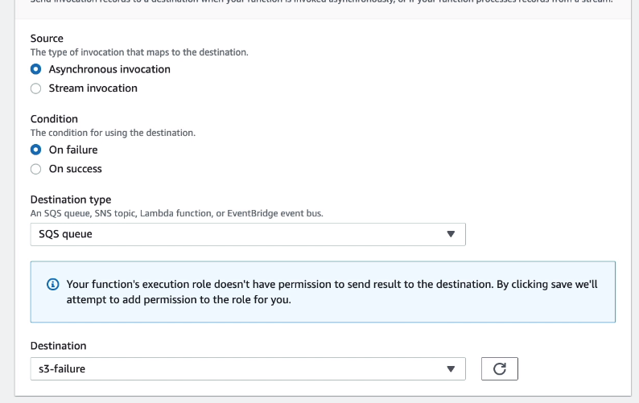
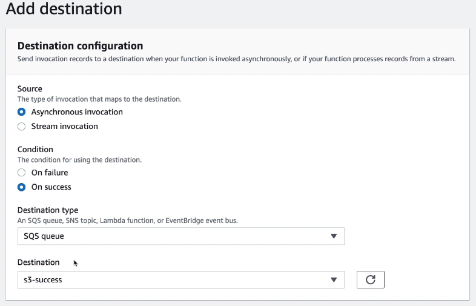
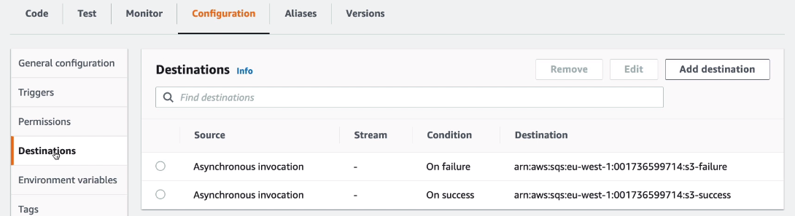
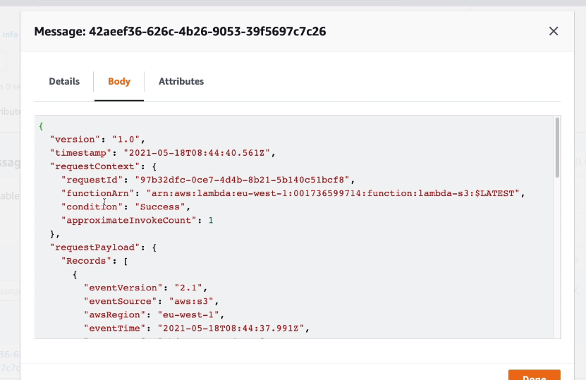

# Lambda Destinations Hands On

We can add a destination for a lambda

We are going to create 2 new queues - one for successful invocations and one for failures. Then we are going to add them as destinations.

Now when executing the lambda, we will see a message in the queue:

