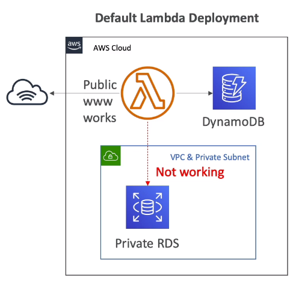
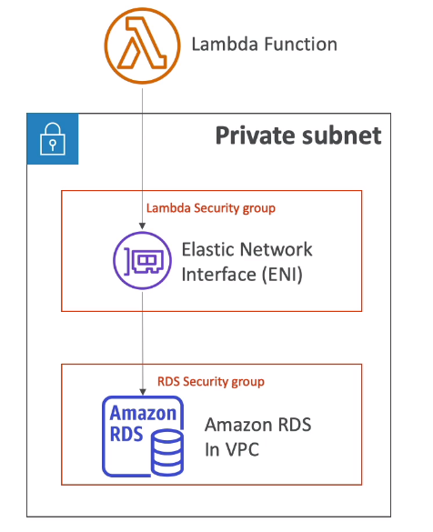
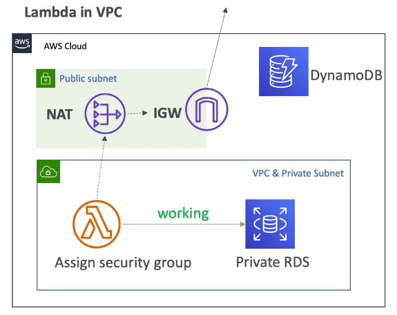

# Lambda in VPC

## Lambda by default

- By default, your Lambda function is launched outside your own VPC (in aan AWS-owned VPC)
- There fore it cannot access resources in your VPC (RDS, ElastiCache, internal ELB...)

## Lambda in VPC

- You must define the VPC ID, the Subnets and the Security Groups
- Lambda will create an ENI (Elastic Network Interface) in your subnets
- AWSLambdaVPCAccessExecutionRole

## Lambda in VPC - Internet Access

- A Lambda function in your VPC does not have internet access
- Deploying a Lambda function in a public subnet does not give it internet access or a public IP
- Deploying a Lambda function in a private subnet gives it internet access if you have a NAT Gateway / Instance
- You can use VPC endpoints to privately access AWS services without a NAT

- Note: Lambda CloudWatch Logs works even without endpoint or NAT Gateway