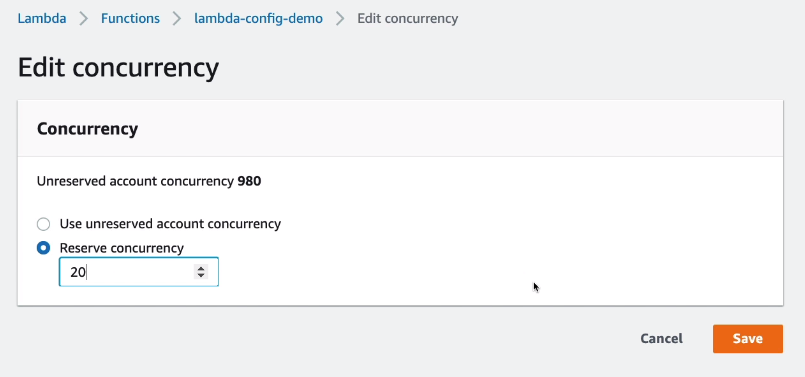
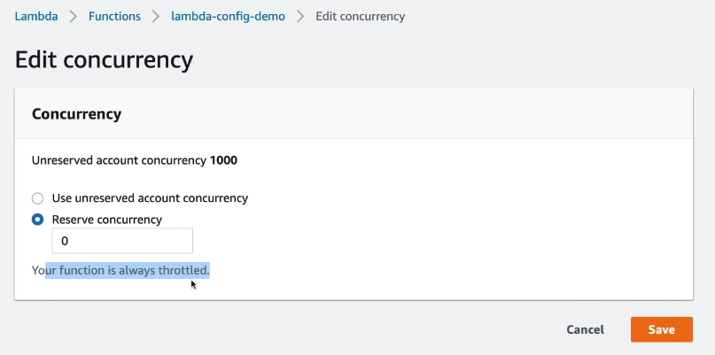
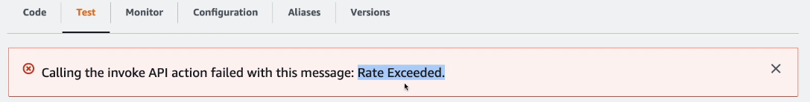
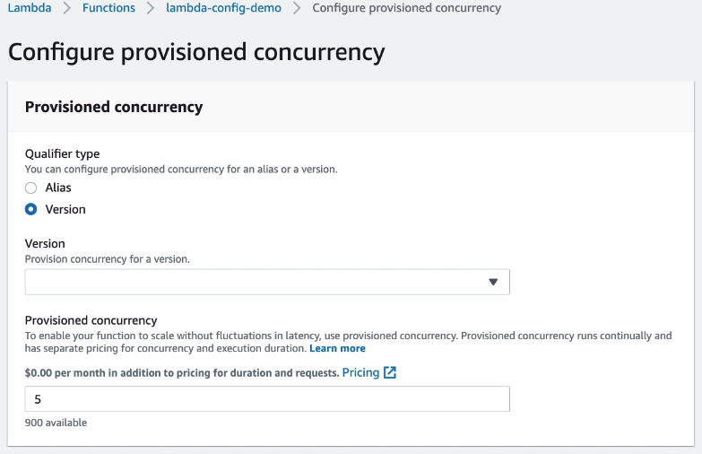

# Lambda Concurrency Hands On

In `Configuration - Concurrency` we can configure the concurrency.

This will leave 980 concurrency for other functions.

Note: you can set the reserve concurrency to 0 and it will become always throttled.

We can also configure provisioned concurrency.

