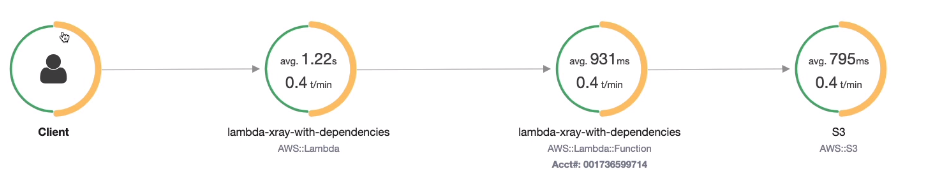

# Lambda External Dependencies Hands On

```js
const AWSXRay = require('aws-xray-sdk-core')
const AWS = AWSXray.captureAWS(requre('aws-sdk'))
const s3 = new AWS.S3()

exports.handler = async function(event) {
    return s3.listBuckets().promise()
}
```

```console
$ npm install aws-xray-sdk
$ chmod a+r *
$ zip -r function.zip .
$ aws lambda create-function --zip-file fileb://function.zip --function-name lambda-xray-with-dependencies --runtime nodejs14.x --handler index.handler --role arn:aws:iam::...:role/DemoLambdaWithDependencies
```

