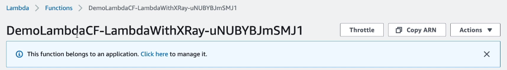

# Lambda and CloudFormation Hands On

```yaml
Parameters:
    S3BucketParam:
        Type: String
    S3KeyParam:
        Type: String
    S3ObjectVersionParam:
        Type: String

Resources:
    LambdaExecutionRole:
        Type: AWS::IAM::Role
        Properties:
            AssumeRolePolicyDocument:
                Version: '2012-10-17'
                Statement:
                - Effect: Allow
                  Principal:
                    Service:
                      - lambda.amazonaws.com
                  Action:
                  - sts:AssumeRole
                Path: "/"
                Policies:
                - PolicyName: root
                  PolicyDocument:
                    Version: '2012-10-17'
                    Statement:
                    - Effect: Allow
                      Action:
                      - logs:*
                      Resource: arn:aws:logs:*:*:*
                    - Effect: Allow
                      Action:
                      - xray:PutTraceSegments
                      - xray:PutTelemetryRecords
                      - xray:GetSamplingRules
                      - xray:GetSamplingTargets
                      - xray:GetSamplingStatisticsSummaries
                      Resource: "*"
                    - Effect: Allow
                      Action:
                      - s3:Get*
                      - s3:List*
                      Resource: "*"
    LambdaWithXRay:
        Type: AWS::Lambda::Function
        Properties:
            Handler: index.handler
            Role:
                Fn::GetAtt:
                    - LambdaExecutionRole
                    - Arn
            Code:
                S3Bucket:
                    Ref: S3BucketParam
                S3Key:
                    Ref: S3KeyParam
                S3ObjectVersion:
                    Ref: S3ObjectVersionParam
            Timeout: 10
            TracingConfig: # enable XRay
                Mode: Active
```

Now we can create a new s3 bucket, upload the function zip file to it. Then import the CloudFormation template and provide the path to the zip file as parameters.


