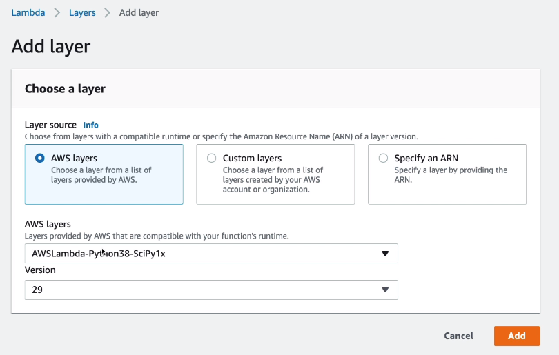

# Lambda Layers Hands On

We are going to create a new function and choose `From scratch` type.
Then we can follow the AWS tutorial on how to create the layers: https://aws.amazon.com/blogs/aws/new-for-aws-lambda-use-any-programming-language-and-share-common-components/

In our lambda function at the bottom of the page we can add a new layer.



So, this is a layer with Pyhon3.8 SciPy library already compiled available to us.

Now we can use code like this without uploading any dependencies:

```python
import numpy as np
from scipy.spatial import ConvexHull

def lambda_handler(event, context):

    print("\nUsing NumPy\n")

    print("random matrix_a =")
    matrix_a = np.random.randint(10, size=(4, 4))
    print(matrix_a)

    print("random matrix_b =")
    matrix_b = np.random.randint(10, size=(4, 4))
    print(matrix_b)

    print("matrix_a * matrix_b = ")
    print(matrix_a.dot(matrix_b))
    print("\nUsing SciPy\n")

    num_points = 10
    print(num_points, "random points:")
    points = np.random.rand(num_points, 2)
    for i, point in enumerate(points):
        print(i, '->', point)

    hull = ConvexHull(points)
    print("The smallest convex set containing all",
        num_points, "points has", len(hull.simplices),
        "sides,\nconnecting points:")
    for simplex in hull.simplices:
        print(simplex[0], '<->', simplex[1])
```