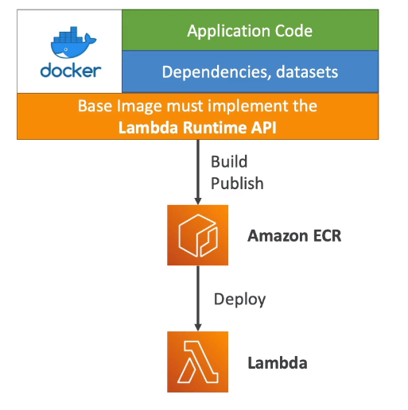

# Lambda Container Images

- Deploy Lambda function as container images of up to 10GB from ECR
- Pack complex dependencies, large dependencies in a container
- Base images are available for Python, Node.js, Java, .NET, Go, Ruby
- Can create your own image as long as it implements the Lambda Runtime API
- Test the containers locally using the Lambda Runtime Interface Emulator
- Unified workflow to build apps



Example: build from the base images provided by AWS

```Dockerfile
FROM amazon/aws-lambda-nodejs:12
COPY app.js package*.json ./
RUN npm install
CMD ["app.lambdaHandler"]
```