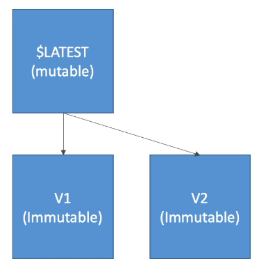
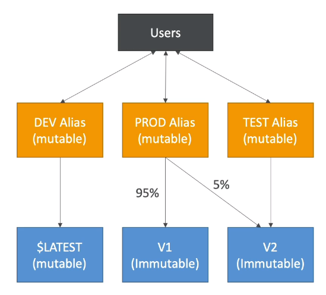

# Lambda Versions and Aliases

## Versions

- When you work on a Lambda function, we work on $LATEST
- When we're ready to publish a Lambda function, we create a version
- Versions are immutable
- Versions have increasing version numbers
- Versions get their own ARN (Amazon Resource Name)
- Version = code + configuration (nothing can be changed - immutable)
- Each version of the lambda function can be accessed

## Aliases

- Aliases are pointers to Lambda function versions
- We can define a "dev", "test", "prod" aliases and have them point at different lambda versions
- Aliases are mutable
- Aliases enable Blue / Green deployment by assigning weights to lambda functions
- Aliases enable stable configuration of our event triggers / destinations
- Aliases have their own ARNs
- Aliases cannot reference aliases

