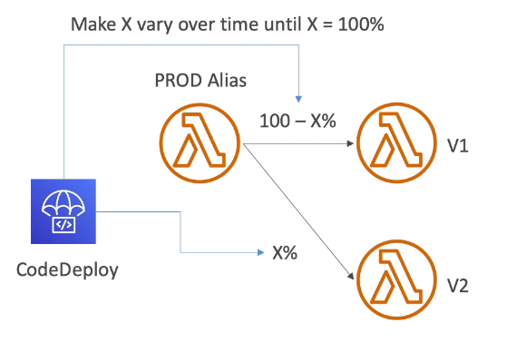

# Lambda & CodeDeploy

- CodeDeploy can help you automate traffic shift for Lambda aliases
- Feature is integrated within the SAM framework
- Linear: grow traffic every N minutes until 100%
- Canary: try X percent then 100%
    - Canary10Percent5Minutes
    - Canary10Percent30Minutes
- AllAtOnce: immediate
- Can create Pre & Post Traffic hooks to check the health of the Lambda functions

