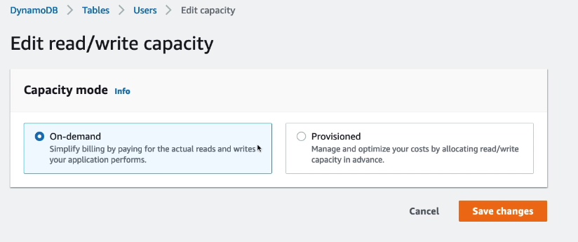
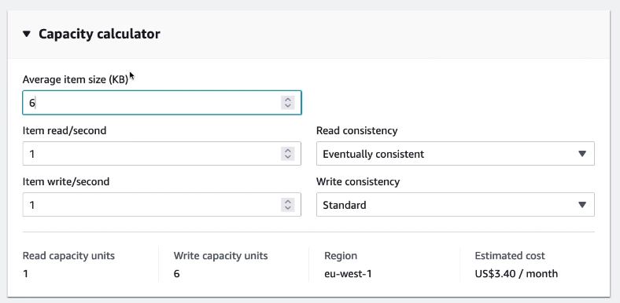
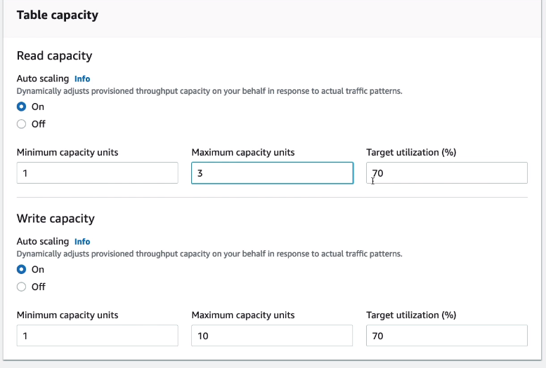
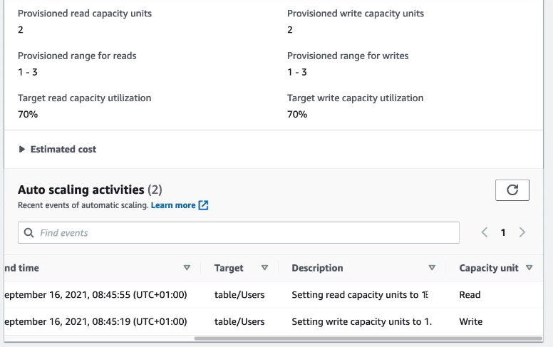

# DynamoDB WCU & RCU - Hands On

You can set the Capacity mode while editing the table. Note that the On-demand mode is 2.5x more expensive than the provisioned one.

When selecting the Provisioned mode, you can use the Capacity Calculator to calculate number of units you need.

Then, you can set the capacity under it.

---

Once done, you can see the provisioned units as well as the autoscaling activities.

