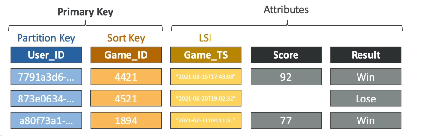
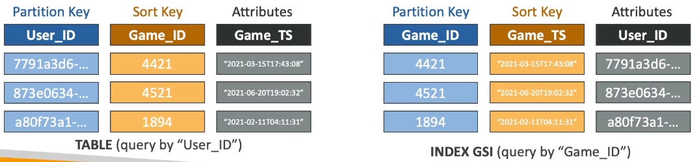

# DynamoDB Indexes (GSI + LSI)

## Local Secondary Index (LSI)

- Alternative Sort Key for your table (same Partition Key as that of base table)
- The Sort Key consists of one scalar attribute (String, Number or Binary)
- Up to 5 local secondary indexes per table
- Must be defined at table creation time
- Attribute Projections - can contain some or all the attributes of the base table (KEYS_ONLY, INCLUDE, ALL)

## Global Secondary Index (GSI)

- Alternative Primary Key (HASH or HASH+RANGE) from the base table
- Speed up queries on non-key attributes
- The Index Key consists of scalar attributes (String, Number, or Binary)
- Attribute Projections - some or all the attributes of the base table (KEYS_ONLY, INCLUDE, ALL)
- Must provision RCUs & WCUs for the index
- Can be added/modified after table creation.

## Throttling

- Global Secondary Index
    - If the writes are throttled on the GSI, then the main table will be throttled!
    - Even if the WCU on the main table are fine
    - Choose your GSI partition key carefully
    - Assign your WCU capacity carefully
- Local Secondary Index
    - Uses the WCUs and RCUs of the main table
    - No special throttling considerations