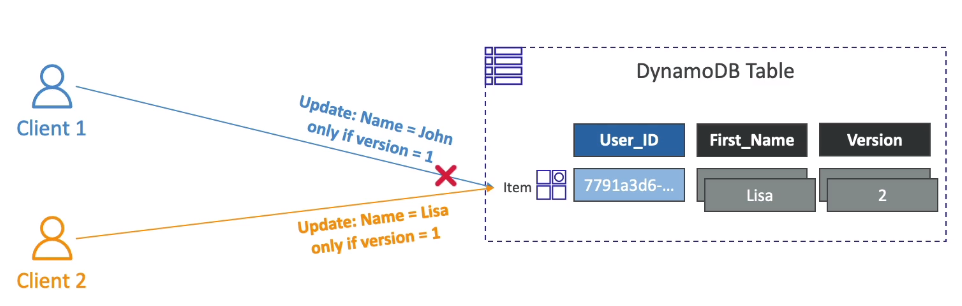

# DynamoDB - Optimistic Locking

- DynamoDB has feature called "Conditional Writes"
- A Strategy to ensure an item hasn't changed before you update/delete it
- Each item has an attribute that acts as a version number.

