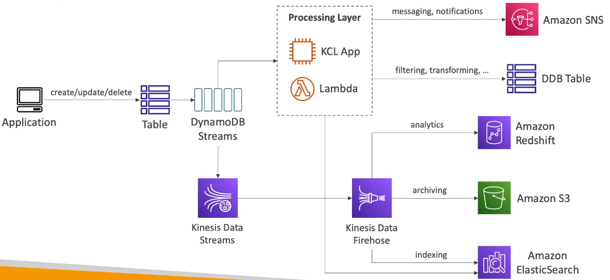
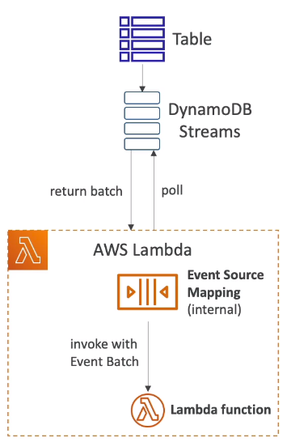

# DynamoDB Streams

- Ordered stream of item-level notifications (create/update/delete) in a table
- Stream records can be:
    - Sent to Kinesis Data Streams
    - Read by AWS Lambda
    - Read by Kinesis Client Library Applications
- Data Retention for up to 24 hours
- Use cases:
    - react to changes in real-time (welcome email to users)
    - analytics
    - insert into derivative tables
    - insert into elasticsearch
    - implement cross-region replication

---

- Ability to choose the information that will be written to the stream:
    - KEYS_ONLY - only the key attributes of the modified item
    - NEW_IMAGE - the entire item, as it appears after it was modified
    - OLD_IMAGE - the entire item, as it appeared before it was modified
    - NEW_AND_OLD_IMAGES - both the new and the old images of the item
- DynamoDB Streams are made of shards, just like Kinesis Data Streams
- You don't provision shards, this is automated by AWS

- Records are not retroactively populated in a stream after enabling it.

## DynamoDB Streams & AWS Lambda

- You need to define an Event Source Mapping to read from a DynamoDB Streams
- You need to ensure the Lambda function has the appropriate permissions
- You Lambda function is invoked syncronously

