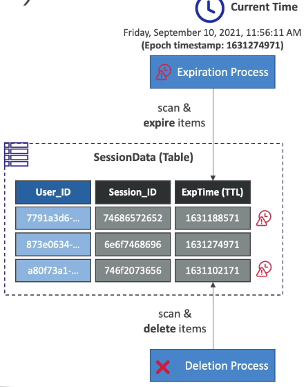
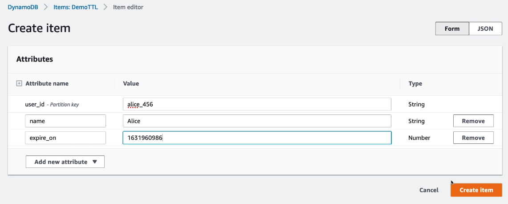
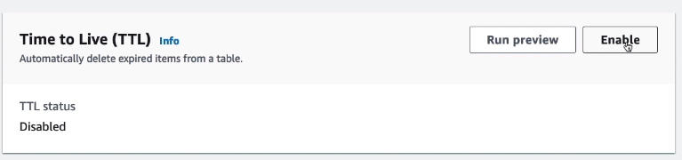
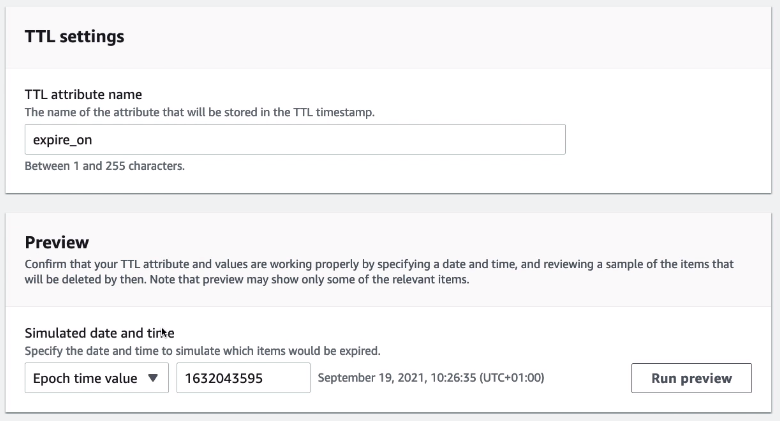

# DynamoDB - Time To Live (TTL)

- Automatically delete items after an expiry timestamp
- Doesn't consume any WCUs (i.e., no extra cost)
- The TTL attribute must be a Number data type with Unix Epoch timestamp value.
- Expired items deleted within 48 hours of expiration
- Expired items, that haven't beeen deleted, appears in reads/queries/scans (if you don't want them, filter them out).
- Expired items are deleted from both LSIs and GSIs
- A delete operation for each expired item enters the DynamoDB Streams (can help recover expired items)
- Use cases: reduce stored data by keeping only current items, adhere to regulatory obligations...

---

