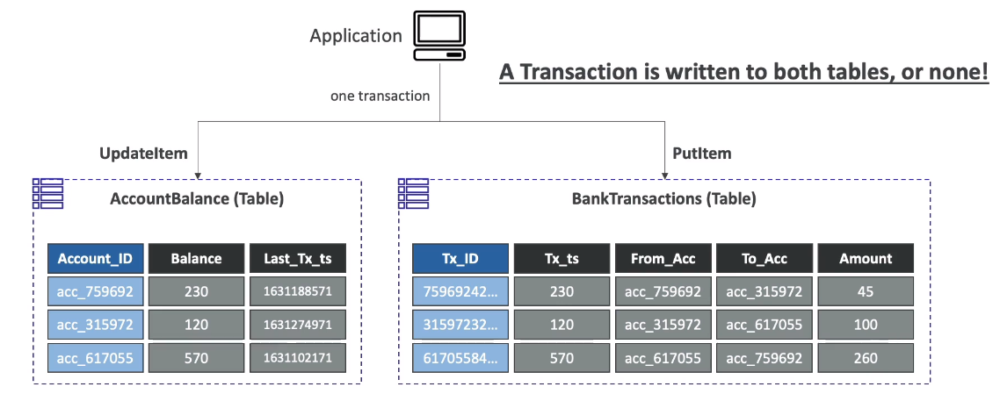

# DynamoDB Transactions

- Coordinate, all-or-nothing operations (add/update/delete) to multiple items across one or more tables.
- Provides Atomicity, Consistency, Isolation, and Durability (ACID)
- Read Modes - Eventual Consistency, String Consistency, Transactional
- Write Modes - Standard, Transactional
- Consumes 2x WCUs & RCUs
    - DynamoDB performs 2 operations for every item (prepare & commit)
- Two operations: (up to 25 unique items or up to 4MB of data)
    - TransactGetItems - one or more GetItem operations
    - TransactWriteItems - one or more PutItem, UpdateItem and DeleteItem operations
- Use cases: financial transactions, managing orders, multiplayer games.

## Capacity Computations

- Example 1: 3 Transactional writes per second, with item size 5KB
    - We need 3 * (5KB/1KB) * 2 (transactional cost) = 30 WCUs
- Example 2: 5 Transactional reads per second, with item size 5KB
    - We need 5 * (8KB/4KB) * 2 (transaction cost) = 20 RCUs
        - 5 gets rounded to the upper 4KB - 8KBs.