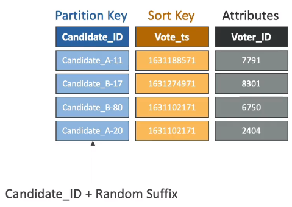

# DynamoDB Write Sharding

- Imagine we have a voting application with two candidates, candidate A and candidate B
- If partion key is Candidate_ID, this results into two partitions, which will generate issues (e.g. Hot Partition)
- A strategy that allows for better distribution of items evenly across partitions
- Add a suffix to partition key value
- Two methods:
    - Sharding using Random Suffix
    - Sharding using Calculated suffix

