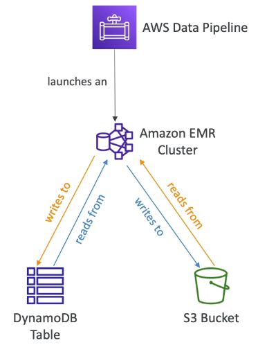

# DynamoDB Operations

- Table Cleanup
    - Option 1: Scan + DeleteItem
        - Very slow, consumes RCU & WCU, expensive
    - Option 2: Drop Table + Recreate table
        - Fast, efficient, cheap
- Copying a DynamoDB table
    - Option 1: Using AWS Data Pipeline
    - Option 2: Backup and restore into a new table
        - takes some time
    - Option 3: Scan + PutItem or BatchWriteItem
        - Write your own code

