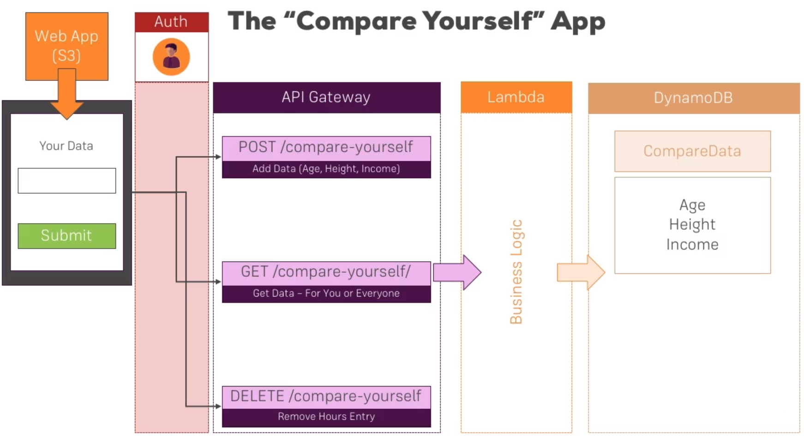

# The "Compare Yourself" app

We are going to host a single page application on S3 where you can submit some data that calls API gateway endpoints to compare yourself.

These endpoints will be auth protected, will implement business logic written on `lambda`. The data will be stored in `DynamoDB` database.

We will use `Route 53` for routing dns, `CloudFront` for caching.

