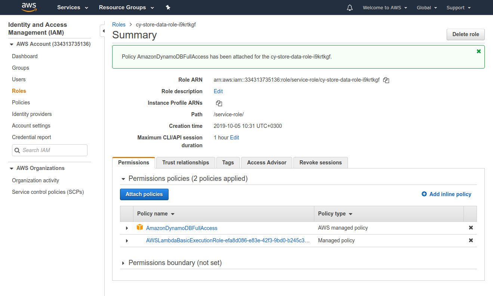
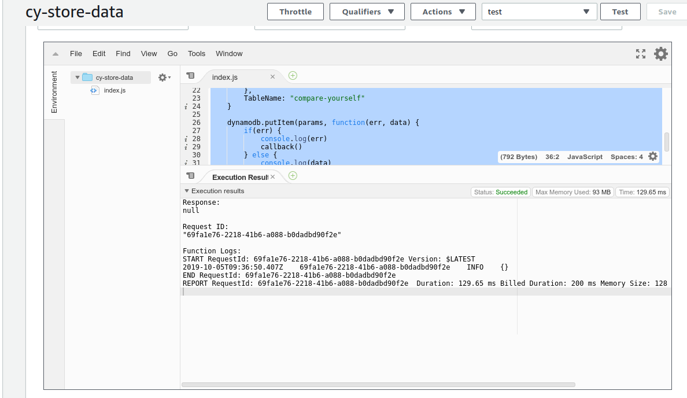
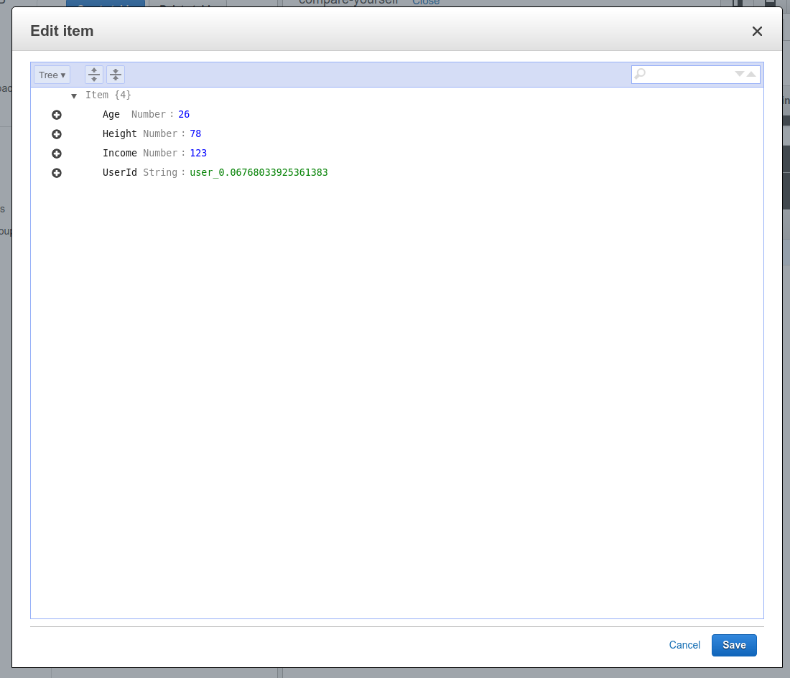

# Accessing DynamoDB from Lambda

We can open up a lambda function and use aws-sdk [integrated DynamoDB class](https://docs.aws.amazon.com/AWSJavaScriptSDK/latest/AWS/DynamoDB.html) to connect to it.

```js
const AWS = require('aws-sdk');
const dynamodb = new AWS.DynamoDB({
    region: 'eu-central-1',
    apiVersion: '2012-08-10'
});
```

## Setting roles

We need to go to `IAM -> Roles` and search for our lambda function. Attach dynamoDB policy.



## Setting up lambda function

We then can put logic to post logic.

```js
const AWS = require('aws-sdk');
const dynamodb = new AWS.DynamoDB({
    region: 'eu-central-1',
    apiVersion: '2012-08-10'
});

exports.fn = (event, context, callback) => {
    const params = {
        Item: {
            "UserId": {
                S: "user_" + Math.random()
            },
            "Age": {
                N: "" + event.age
            },
            "Height": {
                N: "" + event.height
            },
            "Income": {
                N: "" + event.income
            }
        },
        TableName: "compare-yourself"
    }
    
    dynamodb.putItem(params, function(err, data) {
        if(err) {
            console.log(err)
            callback()
        } else {
            console.log(data)
            callback()
        }  
    });
    
}
```

Hit on save and trigger a test.



And we can check the dynamoDB, the item has been added

